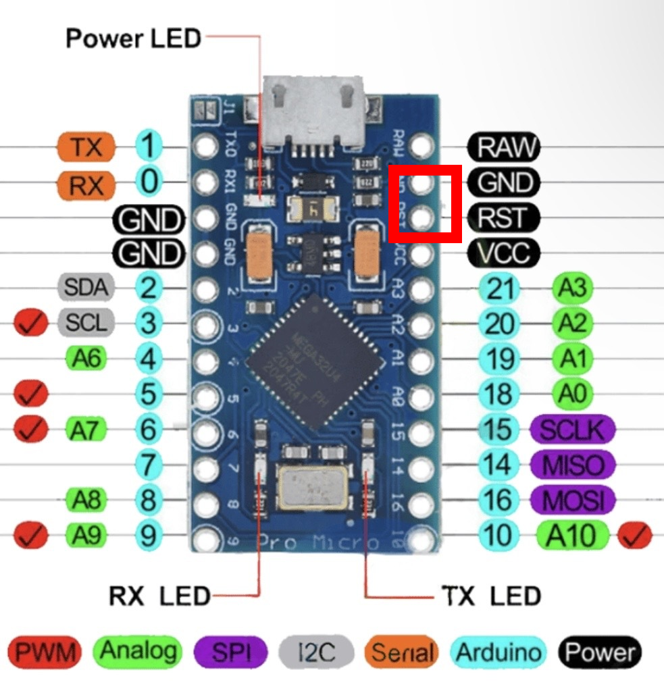
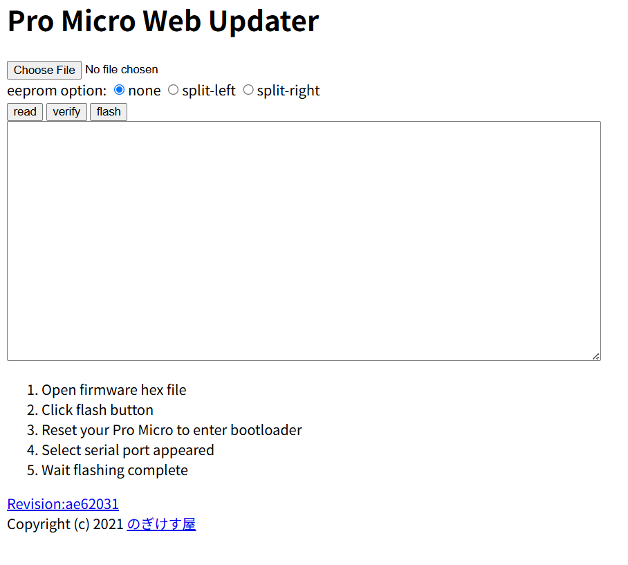
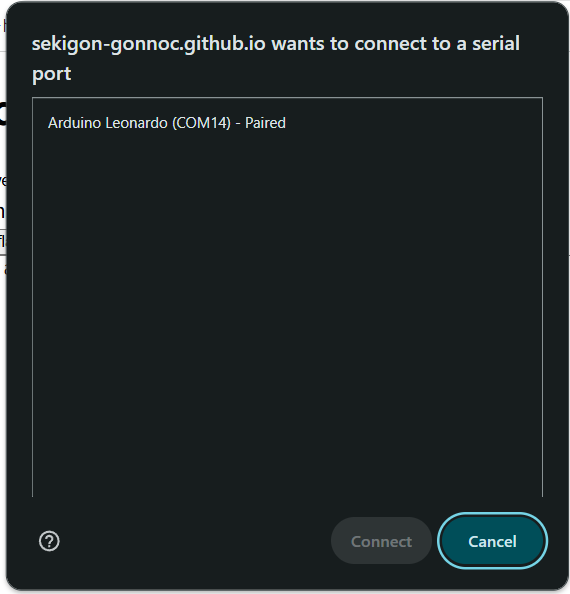
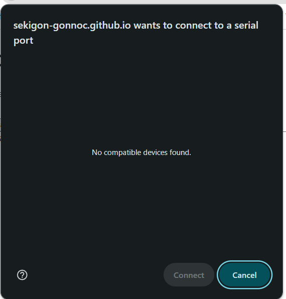
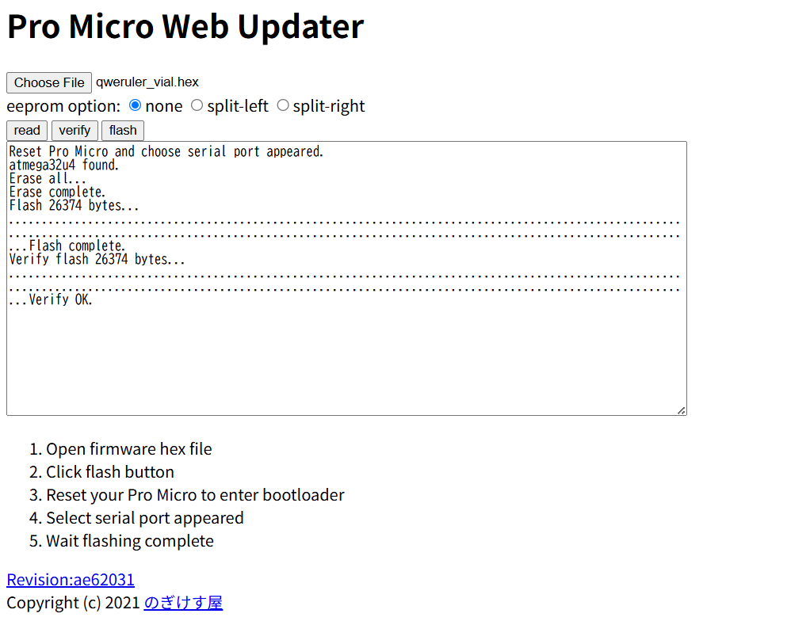
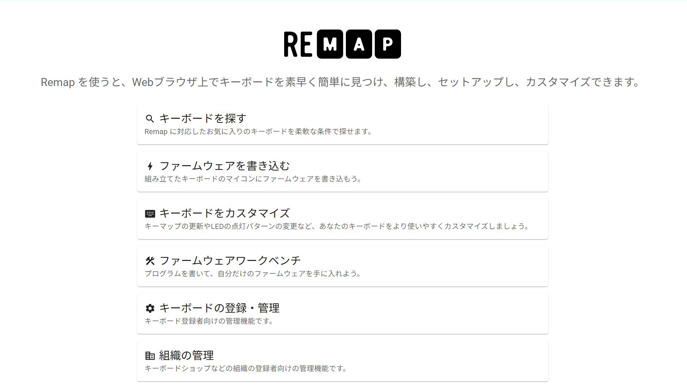
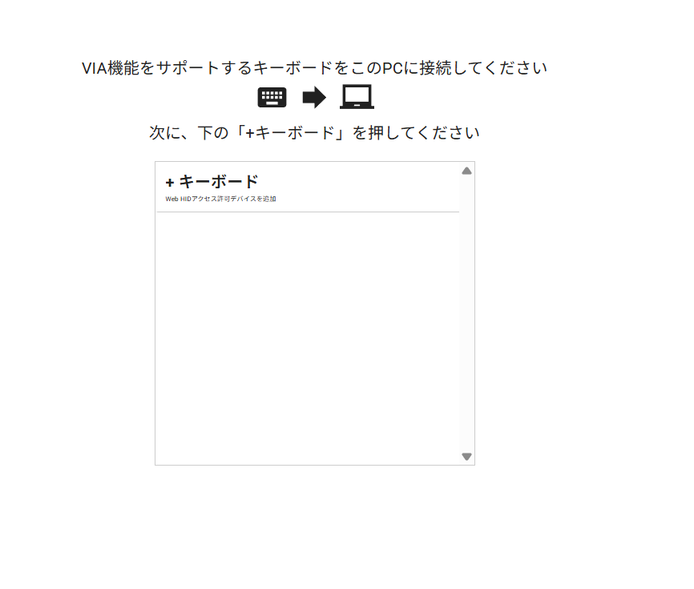
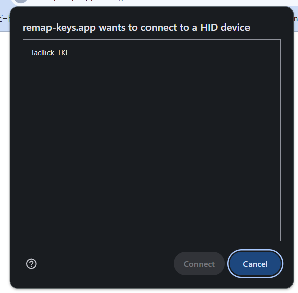
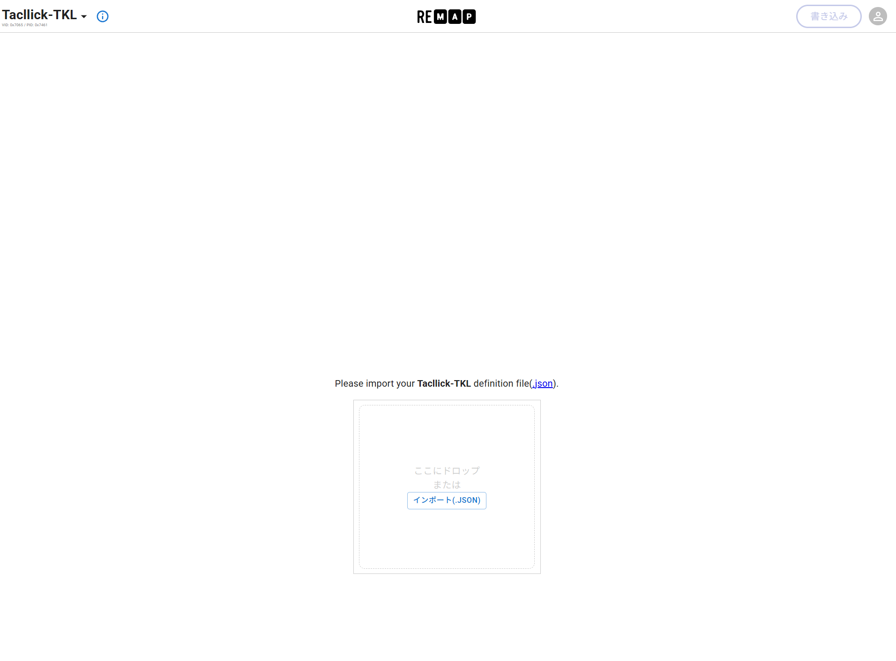
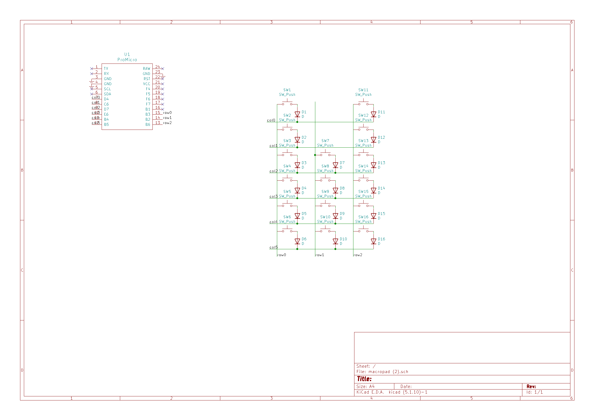

# Kaomoji-Keyboards 取扱説明書
Kaomoji-Keyboards(オリジナルマクロパッド) を購入していただきありがとうございます。

## 1. 注意事項

以下は、実装キットを購入された方への説明書となります。

本製品はDIYキットです。特に、一部バージョンの製品を組み立てる際にははんだごてを含む怪我の危険性のある機器を使用する必要があります。十分注意して作業を行うようにしてください。

また、本製品は完成後、コンピュータ等に接続することで、USBキーボードとして使用することができますが、本製品の使用によって発生するいかなる損失についても、本製品の使用者は自己責任とします。

## 2. 内容物と別途必要なもの

※ 五月祭2025で購入された方
| 品名 | 数量 |
|------|------|
| 基板本体 | 1枚 |
| キースイッチ | 16個 |
| キーキャップ | 16個 |
| M2 4mm, 10mm ネジ | 各6本 |
| M2 3mm, 6mm スペーサー | 各6個 |
| ダイオード 1N4148 | 16本 |
| アクリルトップフレーム | 1個 |
| アクリルボトムプレート | 1個 |
| ProMicro | 1個 |

他に組み立て時に、部品の切断用のニッパー、はんだづけ用の器具、ドライバーなどが必要です、適宜ご用意ください。
また、キースイッチやキーキャップはお好みのものを使用頂けますので、必要であればお好みの　CherryMX互換キースイッチをご用意ください。

### 組み立て前の注意
今回こちらのキットのために用意したProMicroは端子がUSB MicroBのものとなっております。USB-Cをご利用いただきたい場合は、[遊者工房のProMicro](https://shop.yushakobo.jp/products/3905)など別途ご自分で用意されたProMicroをご利用ください。

## 3. 組み立て方

以下の工程でははんだ付けが必要になります。
はんだ付けのやり方については、[イチケンさんの動画](https://www.youtube.com/watch?v=dQ7AUjb1tkA)がわかりやすく、おすすめです。

はんだ付け後、ダイオードのいらない部分はニッパーでカットしてしまいましょう（本来、先にニッパーでカットするのが正しいですが、難易度が上がってしまうため、後回しにしても問題ありません。）

また、説明の際にはQWERuler (基板定規)の画像が用いられる場合があります。

### 1. ダイオードを基板定規にセットする

Kaomoji keyboards　macropadと書かれている面を上面として、部品をセットします。
最初にセットする部品は
- ダイオード (個袋に16本入ったオレンジ色の部品)
です。

ダイオードは、線のあるほうと、ダイオードの黒い線が一致するように差し込みます。

16本分はんだ付けを行い、次の工程に進みます。

### 2. マイコンのはんだ付け

この工程はお好みに合わせて順不同で行なっていただいて構いません。
ただし、３番を先に行う場合、アクリルがはんだ付けの際に邪魔となる場合がありますのでご留意ください。

1. マイコンのはんだ付けは、付属のピンヘッダ（黒のプラスチックの上下に金属がある部品）と基板をはんだ付けするところからはじめます。

1. ピンヘッダの長いほうを基板に差し込み、裏側からはんだ付けします。　

1. 反対側からUSB端子などの部品が載っているほうを上にして、ProMicroを載せて、はんだ付けをします。この際、USBは基板の外側に向きます。

少々はんだ付けが大変な部分ですが、頑張ってください。

完成系はこんな感じになります。

### 　3. キースイッチを基板定規にセットする

次に、
- キースイッチ（黒色の十字ボタンのもの）
をセットします。
その際にアクリルのトッププレートにキースイッチをはめ込む必要があります。
この時点でネジとスペーサーを利用してトッププレートを固定してしまうのがおすすめです。
その際には、
- 10mmネジ
- トッププレート
- 3mmスペーサー
- 基板
- 6mmスペーサー
の順に重なっていることをしっかりと確認してください。
スイッチは上から押しこむことで、固定されます。
各スイッチについて二つの端子それぞれのハンダ付けを完了させたら次の工程に進んでください。

### 4. 組み立てをする
ボトムプレートを4mmネジを用いて固定します。

これでハードウェアは完成になります。

### 5. ファームウェアの書き込み

見た目上は完成していますが、これだけだとProMicroと呼ばれるマイコンにどのキーを押したらどのキーをパソコンに送信するか、という情報が入っていないため、何もできません。

そこで、ここにファームウェアと呼ばれるソフトウェアを書き込みます。

まず、[ここ](https://github.com/uNikks/Pentronic-Lab/releases/tag/kaomoji)から、マクロパッドののファームウェア(`kaomoji_keyboard_default.hex`)をダウンロードします。

ProMicroをPCに接続します。

リセットピンを3回連続短絡させると、ProMicroがリセットされます。（windowsであれば接続解除、接続の音が再度流れるはずです。）
設計の都合上りセットボタンが付いていないので、

の赤く囲まれた端子をドライバーなどで短絡してください。

次に、[Pro Micro Web Updater](https://sekigon-gonnoc.github.io/promicro-web-updater/index.html)にアクセスします。

choose fileから、先ほどダウンロードしてファームウェアを選択してください。

flashボタンを押すと、このような画面が出てきます。

もし、以下の画像のようになっていた場合、リセットやUSB接続をやり直してください。

connectボタンを押すと、書き込みが始まります。（うまくいかない場合はリセットからやり直してください。）

ProMicroのLEDのうち、電源確認用以外のLEDが点灯していれば問題ありません。

このようになっていれば書き込み成功です！

USBをさし直してキーを押してみると、何かしらのキーが打てるはずです。

## 4. キーマップの変更
そのままではあまり役に立たないので、割り当てるキーを変更しましょう。

### 1 remapの場合（日本語対応！）

remapの場合、必要なファイルがもう一つあり、`kaomoji-remap.json`を[ここ](https://github.com/uNikks/Pentronic-Lab/releases/tag/kaomoji)からダウンロードします。

[remap](https://remap-keys.app/)にアクセスし、[サリチル酸さんの記事](https://salicylic-acid3.hatenablog.com/entry/remap-manual)**のRemapにキーマップがマージされていない場合**を参考に、キーマップを変更してください。

キーボードをカスタマイズを押す

キーボードを認識させる（qwerulerと出るはずです。）

ダウンロードした`json`ファイルをここでuploadすると、編集画面が表示される。

### 2 vialの場合（より細かなカスタマイズ・リアルタイム変更！）

再度タクトスイッチから、キーボードをリセットし、`kaomoji_keyboard_vial.hex`を[ここ](https://github.com/uNikks/Pentronic-Lab/releases/tag/kaomoji)からダウンロードし、書き込みを同じ方法で行ってください。

[vial](https://vial.rocks/)にアクセスし、キーマップを変更してください。

vialの詳しい使用法については、[サリチル酸さんの記事](https://salicylic-acid3.hatenablog.com/entry/vial-manual)をご覧ください。

## 5. 回路図

トラブルシューティングのため、回路図を掲載します。

