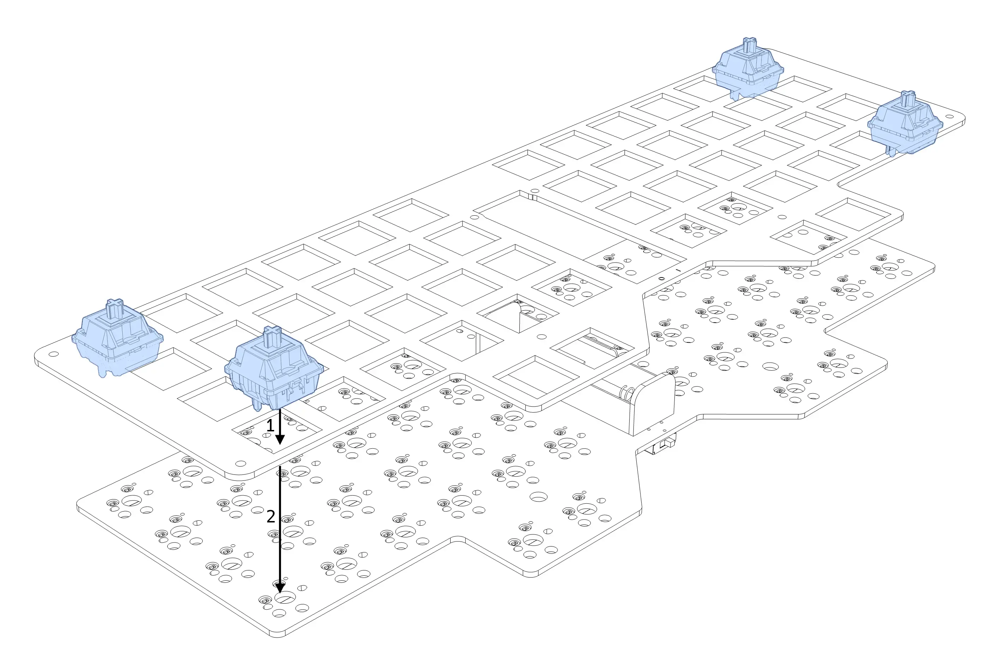
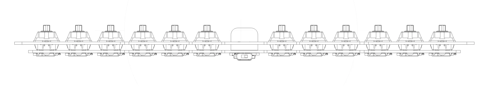
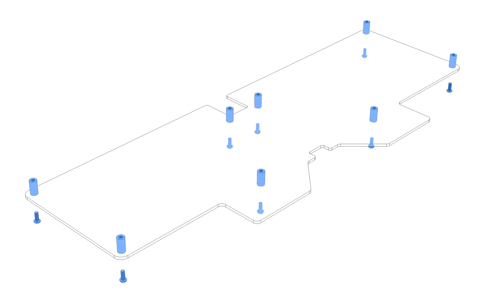
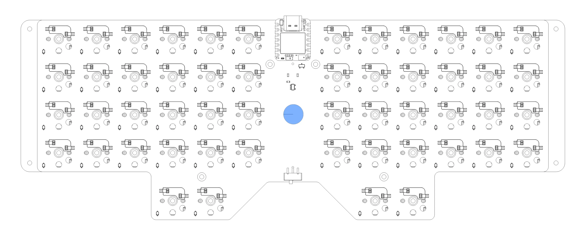
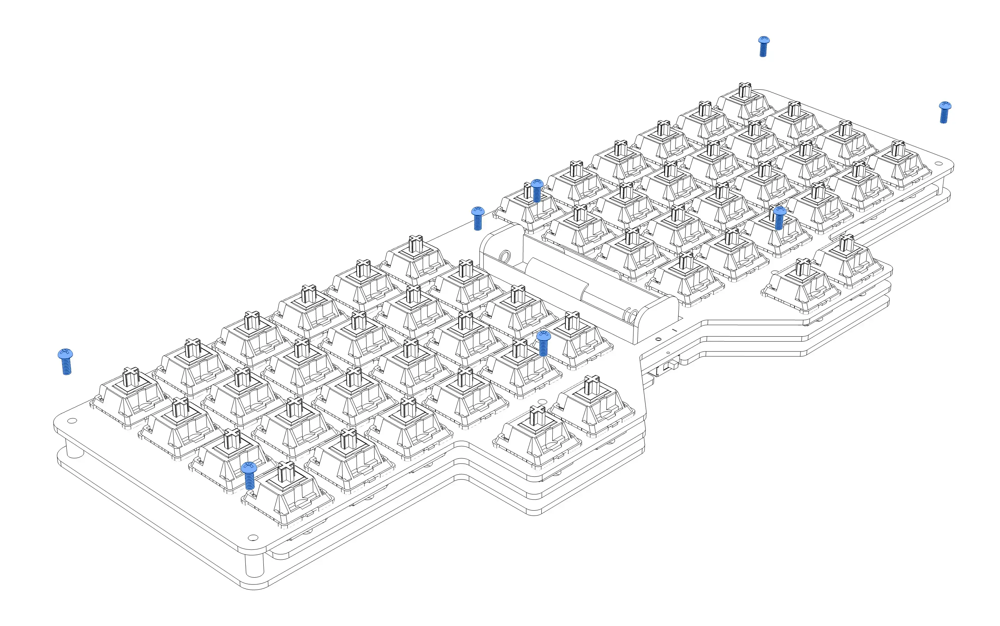
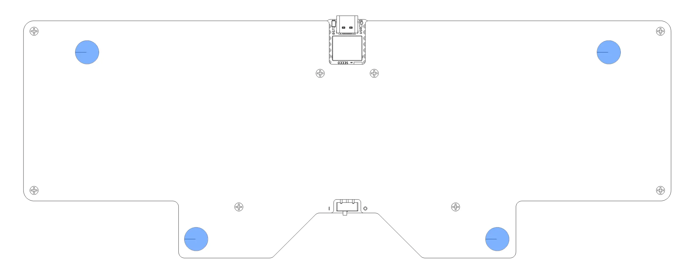
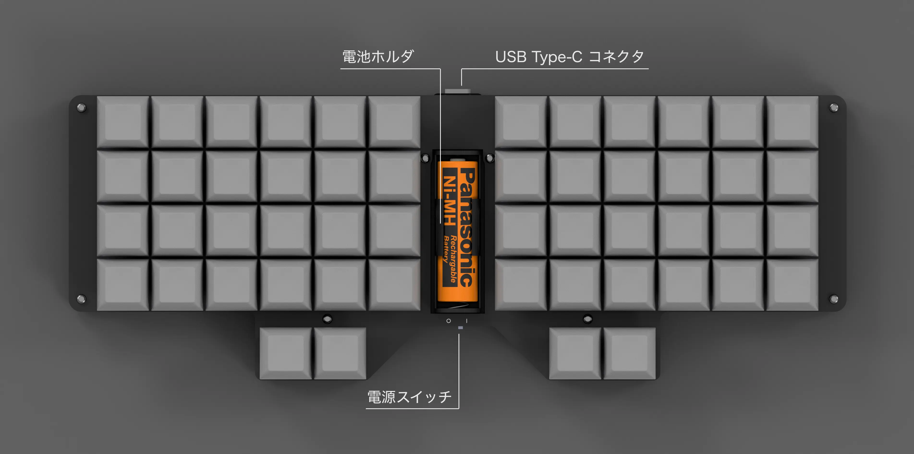
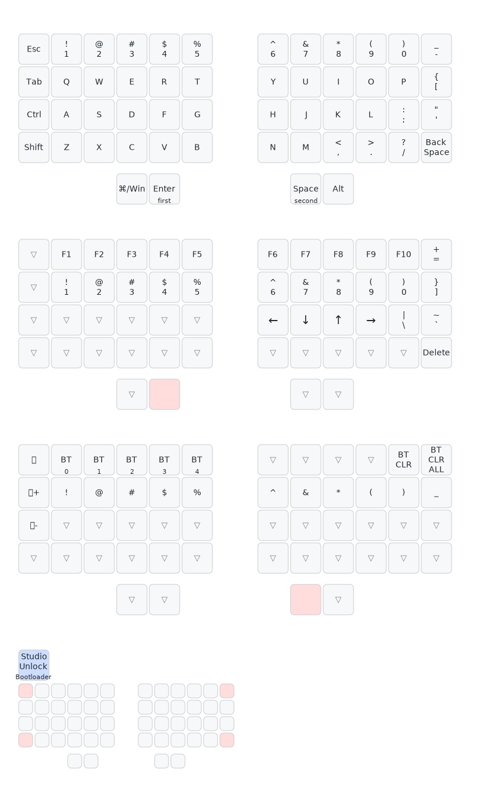
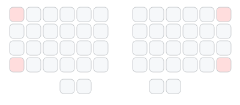

# Vespa ユーザガイド

## 注意事項

本製品はDIYキットです．十分注意して作業を行うようにしてください．

細かい部品が含まれているため，誤飲等に注意してください．

また，本製品の使用によって発生するいかなる損失についても，使用者の自己責任とします。

## 内容物と別途必要なもの

| 内容物 | 個数 |
|------|------|
| メイン基板 | 1 |
| ボトムプレート | 1 |
| トッププレート | 1 |
| M2 5mmネジ | 16 |
| M2 8mmスペーサー | 8 |
| ゴム足(小) | 3 |
| ゴム足(大) | 2 |
| キースイッチ(HMX Xinhai) | 52 |
| キーキャップ(DSA) | 52 |

もし不足があった場合は，お問い合わせより報告をお願いいたします．
M2ネジを留めるための精密ドライバーが工具として必要です．

## 組み立て

### トッププレートを取り付ける

トッププレートの６つの隅の穴にキースイッチをはめ込みます．
キースイッチを上から見たときに，四角い穴が下向きになるように取り付けてください．
また，スイッチの端子が曲がっていないことを確認してください．
端子が曲がっていた場合，ペンチや指等でまっすぐに直してください．

6つの隅部分にキースイッチを取り付けたら，トッププレートをメイン基板に重ね，スイッチの端子をソケットにはめ込みます．
キースイッチの端子が基板の穴に正しく挿入されていることを確認してください．

### 残りのスイッチを取り付ける

トッププレートとメイン基板が固定されたら，残りのキースイッチを端の方から順に取り付けていきます．
このときも，スイッチの向きと端子が曲がっていないことを確認してください．

*スイッチを取り付け後，横から見た図*

すべてのスイッチを取り付けたら，横から見て，メイン基板から浮いているスイッチがないか確認してください．
スイッチが浮いている(ソケットに正しく挿入されていない)場合，メイン基板に付くまで押し込んでください．

> [!NOTE]
> 端の方のスイッチは浮きやすいため，特に注意して確認してください．

### 動作確認を行う

すべてのキースイッチを取り付けたら，USBケーブルを使用してキーボードをパソコンに接続し，動作確認を行います．
接続時に左Shiftの右にあるキーや右Shiftの左にあるキーを押すように求められた場合，それぞれ`Z`および`/`キー([キーマップ](#キーマップ)を参照)を押してください．
入力方式を選択するように求められた場合，ANSI（US・米国配列）を選択してください．

キーを押して，正しい文字が入力されることを確認してください．
もし，正しく入力されないキーがあった場合，キースイッチの端子が正しく挿入されているか確認し，必要に応じて修正してください．

### 組み立てる

すべてのキースイッチが正しく動作することを確認したら，ボトムプレートをメイン基板の裏側に取り付けます．
M2 5mmネジと8mmスペーサーを使用して，ボトムプレートの8箇所の穴にスペーサーを取り付けます．
このとき，ネジを完全に締めず，8割程度に留めておいてください．

次に，メイン基板裏側中央部(電池ボックスの真下に当たる部分)にゴム足(小)を一つ取り付けます．

最後に，組み立てたメイン基板をボトムプレートに重ね，トッププレートの上からM2 5mmネジで固定します．
穴の位置が合わず，ネジがうまく締まらない場合，ボトムプレートのネジを少し緩めて調整してください．

すべてのネジを締めたら，緩めに締めていたネジをしっかりと締め直してください．

### ゴム足を取り付ける

ボトムプレート底面4箇所にゴム足を取り付けます．
このとき，手前側には小さいゴム足を，奥側には大きいゴム足を取り付けてください．

キーボードをより傾斜させたい場合，100円ショップ等で販売されているゴムシートを使用して奥側の高さを調整すると良いでしょう．

### キーキャップを取り付ける

キーキャップをキースイッチに取り付けます．

> [!NOTE]
> キーキャップの取り付けには比較的大きな力が必要な場合があります．
> スイッチに対して垂直に押し込むように注意してください．
> 斜め方向の力や，ねじるような力を加えると，キーキャップやスイッチが破損する恐れがあります．

以上で組み立ては完了です．

## 各部名称

電源スイッチは右側がオン，左側がオフです．

## 電源

### 電池を使用する場合

> [!CAUTION]
> - 使用可能な電池は単三形乾電池または充電式ニッケル水素電池(エネループ等)です．
> - 電池の交換は，必ず電源を切ってから行ってください．
> - 電池を交換する際は，電池ホルダの上下部分を押さえて交換してください．
> - 電池は正しい向き(+極が上)で挿入してください．逆向きに挿入すると故障の原因となります．
> - 電池が切れた場合，速やかに取り除いてください．
> - 長期間使用しない場合，電池を取り除いてください．

1. キーボードの電源スイッチがオフの位置になっており，USBケーブルが接続されていないことを確認します．
2. キーボード中央部の電池ホルダに電池を挿入します．
3. キーボードの電源スイッチをオンの位置に切り替えます．

### USBケーブルを使用する場合

USB Type-Cケーブルを使用してキーボードを接続します．

> [!NOTE]
> - 長期間USB接続で使用する場合，電池を取り除いてください．
> - 電源スイッチは電池の接続にのみ影響し，USB接続には影響しません．

### スリープ機能

30分間キー入力がない場合，キーボードはスリープモードに入ります．
スリープモードから復帰するには，任意のキーを押してください．
スリープからの復帰には数秒かかる場合があります．

スリープ機能をオフにする方法については，後述の「[スリープ機能をオフにする](#スリープ機能をオフにする)」を参照してください．

> [!TIP]
> 通常使用時はスリープ機能を活用し，電源スイッチは持ち運び時などに使用することをお勧めします．

## キーボードをBluetoothで接続する

1. キーボードの電源スイッチをオンの位置に切り替えます．
2. 接続先端末(パソコン等)のBluetooth設定画面を開きます．
3. "Vespa"を選択してペアリングを行います．

## キーマップ

デフォルトのキーマップは以下の通りです．
Vespaでは，レイヤーという概念を使用して，同じキーに複数の機能を割り当てることができます．
Enterキーを長押しするとレイヤー1(下の図で"first")，Spaceキーを長押しするとレイヤー2(下の図で"second")に切り替わります．
例えば，`=`キーを入力する場合，Enterキーを長押ししながら右上の`-`キーを押します．`+`を入力する場合は，さらにShiftキーを押しながら同じ操作を行います．

## キーマップの変更

キーマップの変更は[ZMK Studio](https://zmk.studio)を使用して行います．
[アプリ版ZMK Studio](https://zmk.studio/download)ではBluetooth経由のキーマップ変更が可能です．

1. [ZMK Studio](https://zmk.studio)にアクセス，またはアプリを起動します．
2. キーボードをUSBケーブル等で接続します．
3. "Unlock To Continue" というダイアログが表示されたら，キーボードの四隅のキーを同時に押してください(長押ししないでください)．

4. キーを選択して好きなキーコードなどを割り当てることができます．レイヤーを追加したりすることも可能です．
5. 最後に，右上の"Save"ボタンを押してキーマップを保存します．

キーマップ設定についての詳細は，[ZMKのドキュメント(Keymaps & Behaviors)](https://zmk.dev/docs/keymaps)を参照してください．

## 複数のデバイスとペアリングする

Vespaは最大5台のデバイスとペアリングできます．
`BT 0`から`BT 4`までのキーを押すと，接続先デバイスを切り替えることができます．

例えば，最初にPCに接続していて，タブレットにも接続したい場合，以下の手順で行います:

1. Bluetoothプロファイルのうち，`BT 0`はPCとの接続に使用されており，`BT 1`から`BT 4`は未使用です．
2. 未使用のプロファイルのいずれか(例えば`BT 1`)を選択(デフォルトではレイヤー2で`2`キー)すると，キーボードがペアリングモードに入ります．
3. タブレットのBluetooth設定画面を開き，"Vespa"を選択してペアリングを行います．
4. 以降，`BT 0`キーを押すとPCに接続，`BT 1`キーを押すとタブレットに接続されます．

プロファイルを未使用に戻す場合は，`BT CLR`キー(デフォルトではレイヤー2で`0`キー)を押してペアリング情報をクリアしてください．

## スリープ機能をオフにする

スリープ機能をオフにする場合，以下の手順で行います:

1. [ファームウェアのダウンロードページ](https://github.com/object1037/vespa-zmk-module/releases/latest)から，`vespa_firmware.zip`をダウンロードします．
2. ダウンロードしたZIPファイルを解凍し，中に`vespa_fw_caffeinated.uf2`というファイルが含まれていることを確認します．
3. キーボードをUSBケーブルでパソコンに接続します．
4. キーボードの四隅のキーを3秒以上同時に押し続けます．
5. キーボードが外部記憶ディスクとして認識されるので，その中に`vespa_fw_caffeinated.uf2`をコピーします．
6. コピーが完了し，ディスクが自動的に取り外されたら完了です．

> [!NOTE]
> ファームウェアのコピー時に，ファイル転送やディスク取り出しに関するエラーが表示されることがありますが，問題ありません．

スリープ機能を再度有効にする場合は，同様の手順で`vespa_fw.uf2`を使用してください．

## トラブルシューティング

### Bluetooth接続できない

以下の点を確認してください：

- 電池を新品に交換してみてください．
- キーボードの電源を一度オフにしてから再度オンにしてみてください．
- `BT_SEL`が割り当てられているキー(デフォルトではレイヤー2で`1`から`5`キー)を押してBluetoothプロファイルを切り替えてみてください．
- キーマップで出力先変更のキーを割り当てている場合，`OUT_BLE`や`OUT_TOG`が割り当てられているキーを押してみてください．
- 以上を試しても接続できない場合，`BT_CLR`や`BT_CLR_ALL`が割り当てられているキー(デフォルトではレイヤー2で`0`, `-`キー)を押してペアリング情報をクリアし，再度ペアリングを試みてください．

### 記号が正しく入力できない

「[動作確認を行う](#動作確認を行う)」を参照し，PC等でキーボードの種類・レイアウトをANSI（US・米国配列）に設定してください．

### 反応しないキーがある

「[残りのスイッチを取り付ける](#残りのスイッチを取り付ける)」を参照し，該当のキーが正しく取り付けられているか確認してください．

## 参考情報

ハードウェアの設計情報やファームウェアのソースコード，ケースの3Dプリント用データ等は，[こちらのGitHubリポジトリ](https://github.com/object1037/Vespa)から入手できます．
