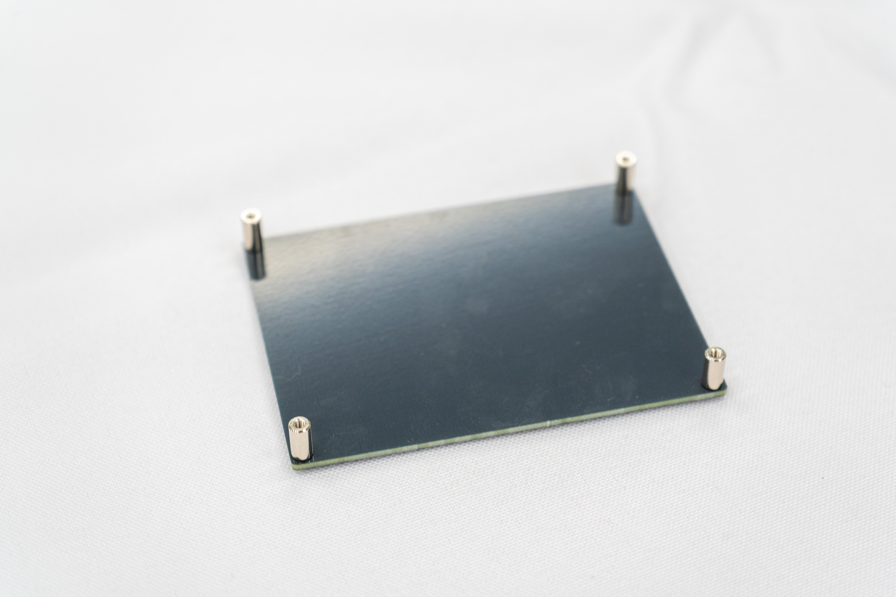
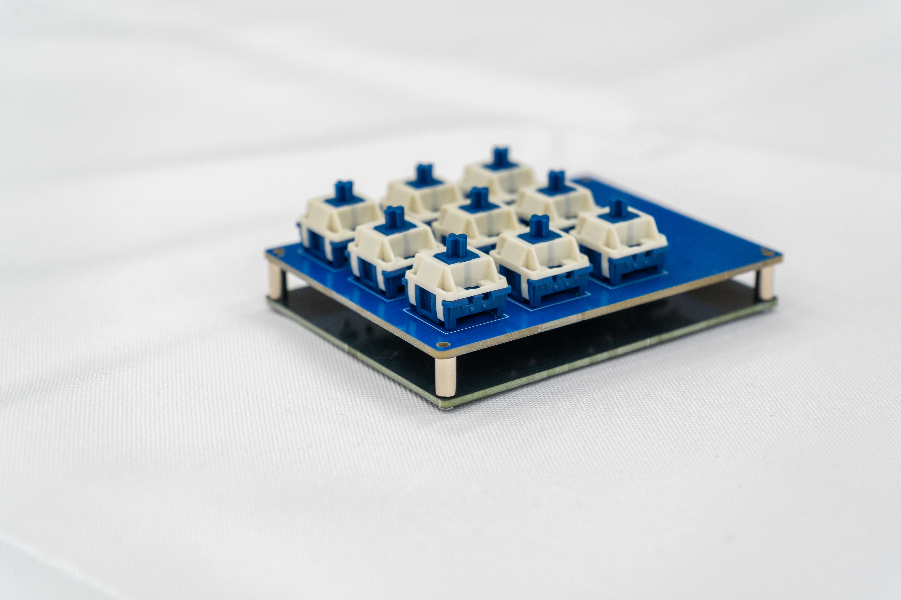
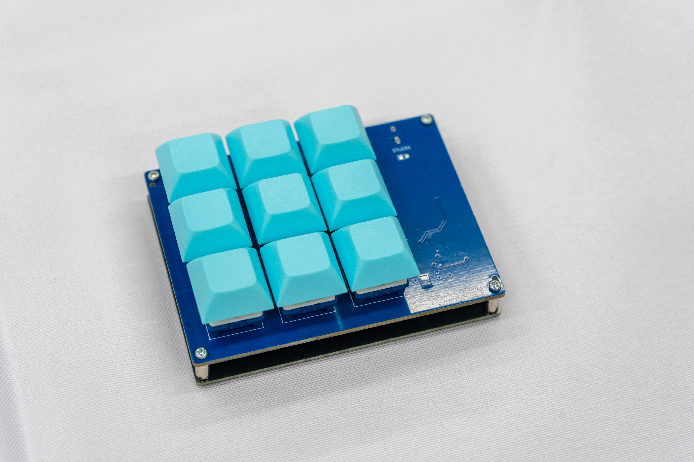
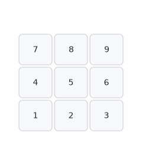

# kokonotsu User Guide

nurikabeをご購入いただきありがとうございます。

## 注意

---

本製品はDIYキットです。

**怪我・紛失:** ネジやスペーサーなど、細かい部品を含みます。部品の紛失には十分ご注意ください。

**免責事項:** 本製品の製作、および使用により発生したいかなる損害に関しても、使用者の自己責任となります。あらかじめご了承ください。

## 内容物

---

製作前に、部品が揃っているかご確認ください。

スペーサーとネジは予備として多めに入っています。

| **内容物** | **数量** |
| --- | --- |
| M2 5mmネジ　 | 8本 |
| M2 8mmスペーサー | 4個 |
| ボトムプレート | 1枚 |
| PCB基盤 | 1枚 |
| キースイッチ | 9個 |
| キーキャップ | 9個 |

※M2ネジを留めるには精密ドライバーが必要です。お持ちでない場合を別途お買い求めください。

また、追加で0603サイズのチップLEDをご購入いただくと、作動確認ランプとして使用できます。（なくても動作はします） [秋月電子などで販売されている](https://akizukidenshi.com/catalog/g/g118279/)汎用品が使用できます。IF 30mA, VF 2.5-2.9V 程度のLEDを推奨します。

## 組み立て方法

---
※試作品にて組み立て方法を撮影しています

### 1.ファームウェアの動作確認

USBケーブルを使用してパソコンとkokonotsuを接続します。

PC上にフォルダ（ドライブ）が開かない場合：接続した状態で、USB端子の隣にある**RESETボタンを2回**押してください。「RPI-RP2」というドライブとして認識されます。

起動したら、[https://github.com/uNikks/Pentronic-Lab/releases/tag/taclick-tkl](https://github.com/uNikks/Pentronic-Lab/releases/tag/taclick-tkl)にあるkokonotsu_defult.uf2 をダウンロードします。

ダウンロードしたファイルを、先ほど開いた「RPI-RP2」ドライブ（エクスプローラー）へドラッグ＆ドロップしてください。
自動的に再起動し、キーボードとして認識されれば成功です！

### 2. スイッチをはんだ付けする
上からスイッチを刺して、裏面からはんだ付けをします。

**駒場祭配布版ではスイッチがFeker Holy Pandaとなっているため、固定がスイッチの2穴と真ん中の穴の3つでしかできません。そのため、はんだ付けの際は1か所ずつ順番にはんだ付けし、スイッチがきれいに配置されるようにすることをお勧めします。**

### 3.ボトムプレートの取り付け

ボトムプレートの4箇所の穴に、下からネジを通します。飛び出したネジ山に対し、スペーサーを指でくるくると回して固定します。

スペーサーの付いたボトムプレートの上に、基板を重ねます。ネジ穴の位置が合うように調整してください。

### 4.キーキャップをはめる

仕上げにキーキャップを取り付けます。 キースイッチの十字（+）と、キーキャップ裏側の十字（+）が合うように向きを確認し、垂直に押し込みます。すべて取り付けたら完成です。

以上で組み立ては終了です。お疲れ様でした。

## キーマップ

---

デフォルトのキーマップは以下の構成になっております。

キーボードのキーマップは変更することが可能です。

その場合必要なファイルがもう一つあり、nurikabe_via.jsonをここからダウンロードします。

[remap](https://remap-keys.app/)にアクセスし、[サリチル酸さんの記事](https://salicylic-acid3.hatenablog.com/entry/remap-manual)**のRemapにキーマップがマージされていない場合**を参考に、キーマップを変更してください。

キーボードをカスタマイズを押す     

 キーボードを認識させる

ダウンロードしたファイルをここでuploadする。

あなただけのキーマップを作り上げましょう！