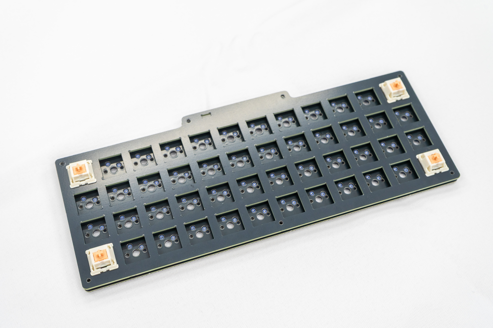
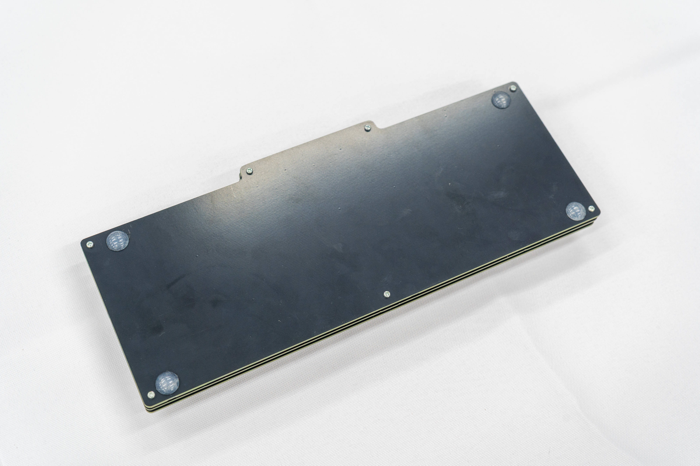
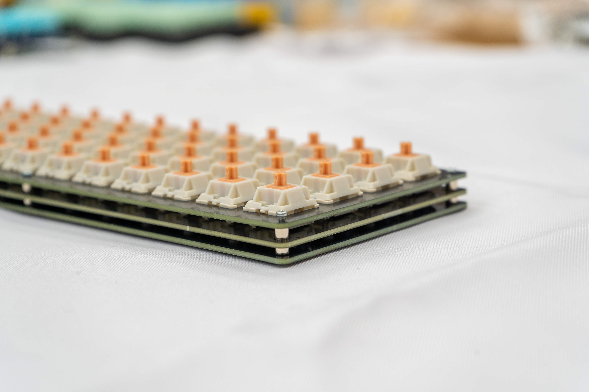
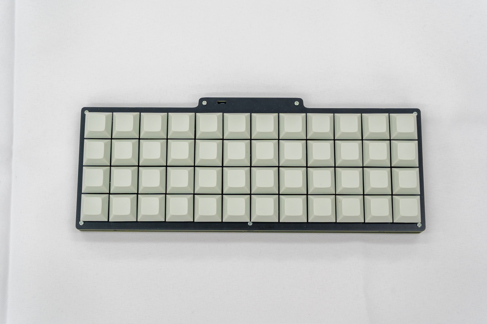
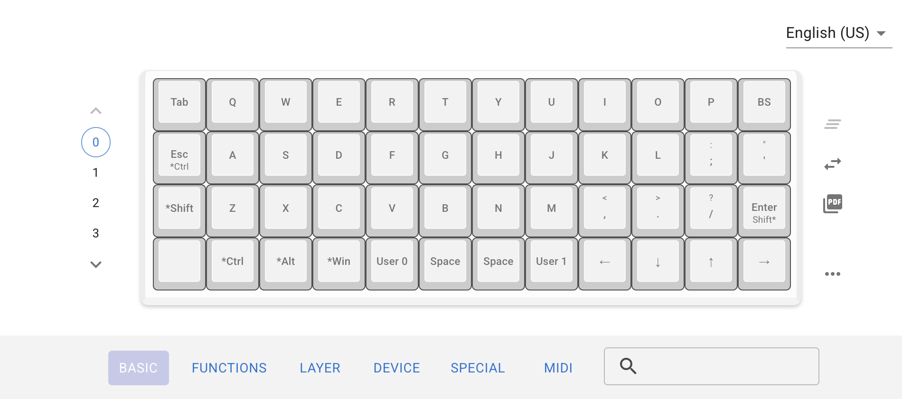

# nurikabe User Guide

nurikabeをご購入いただきありがとうございます。

## 注意

---

本製品はDIYキットです。

**怪我・紛失:** キースイッチの端子やネジなど、細かく鋭利な部品を含みます。作業中の怪我や部品の紛失には十分ご注意ください。

**免責事項:** 本製品の製作、および使用により発生したいかなる損害に関しても、使用者の自己責任となります。あらかじめご了承ください。

## 内容物

---

製作前に、部品が揃っているかご確認ください。

スペーサーとネジは予備として多めに入っています。

| **内容物** | **数量** |
| --- | --- |
| M2 5mmネジ　 | 14本 |
| M2 8mmスペーサー | 7個 |
| トッププレート | 1枚 |
| ボトムプレート | 1枚 |
| PCB基盤 | 1枚 |
| キースイッチ | 48個 |
| キーキャップ | 48個 |

※M2ネジを留めるには精密ドライバーが必要です。お持ちでない場合を別途お買い求めください。

また、追加で0603サイズのチップLEDをご購入いただくと、作動確認ランプとして使用できます。（なくても動作はします） [秋月電子などで販売されている](https://akizukidenshi.com/catalog/g/g118279/)汎用品が使用できます。IF 30mA, VF 2.5-2.9V 程度のLEDを推奨します。

## 組み立て方法

---

### 1.キースイッチを取り付ける

トッププレートの裏表を確認します。まずは四隅の4箇所だけ、キースイッチを「カチッ」と音がするまではめ込みます。 

その後、PCB（基板）の隅の穴とスイッチの足の位置を合わせ、慎重に取り付けます。これにより、プレートと基板のズレが抑えられ、作業がしやすくなります。

**注意：** キースイッチの端子が曲がっていないか必ず確認してください。曲がっている場合は、指やピンセットで真っ直ぐに直してから挿入してください。

残りの44個のキースイッチも同様に、端子が真っ直ぐであることを確認しながら、トッププレートの上から慎重に基板へと取り付けます。

全てのキースイッチの取り付けが終わったら、横から見てトッププレートが基盤と水平であるか確認します。

もし傾いている場合、適宜キースイッチを押し込むなどして微調整します。

### 2.ファームウェアの動作確認

全てのキースイッチを取り付けた後、USBケーブルを使用してパソコンとnurikabeを接続します。

PC上にフォルダ（ドライブ）が開かない場合：接続した状態で、USB端子の隣にある**RESETボタンを2回**押してください。「RPI-RP2」というドライブとして認識されます。

起動したら、[https://github.com/uNikks/Pentronic-Lab/releases/tag/taclick-tkl](https://github.com/uNikks/Pentronic-Lab/releases/tag/taclick-tkl)にあるnurikabe_defult.uf2 をダウンロードします。

ダウンロードした nurikabe_defult.uf2  ファイルを、先ほど開いた「RPI-RP2」ドライブ（エクスプローラー）へドラッグ＆ドロップしてください。
自動的に再起動し、キーボードとして認識されれば成功です！

### 3.ボトムプレートの取り付け

ボトムプレートの7箇所の穴に、下からネジを通します。飛び出したネジ山に対し、スペーサーを指でくるくると回して固定します。

スペーサーの付いたボトムプレートの上に、先ほどスイッチを取り付けた「基板＋トッププレート」のセットを重ねます。ネジ穴の位置が合うように調整してください。

トッププレートの上からネジで止めれば完成は目前です！！

### 4.キーキャップをはめる

仕上げにキーキャップを取り付けます。 キースイッチの十字（+）と、キーキャップ裏側の十字（+）が合うように向きを確認し、垂直に押し込みます。48個すべて取り付けたら完成です。

以上で組み立ては終了です。お疲れ様でした。

## キーマップ

---

デフォルトのキーマップは以下の構成になっております。

.svg)

nurikabeではレイヤーという機能により、同じキーに複数の機能が割り当てられています。

例えばLowerキーを長押ししながらAのキーを押すと、1が入力できます。

キーボードのキーマップは変更することが可能です。

その場合必要なファイルがもう一つあり、nurikabe_via.jsonをここからダウンロードします。

[remap](https://remap-keys.app/)にアクセスし、[サリチル酸さんの記事](https://salicylic-acid3.hatenablog.com/entry/remap-manual)**のRemapにキーマップがマージされていない場合**を参考に、キーマップを変更してください。

キーボードをカスタマイズを押す     

 キーボードを認識させる

ダウンロードしたファイルをここでuploadする。

あなただけのキーマップを作り上げましょう！