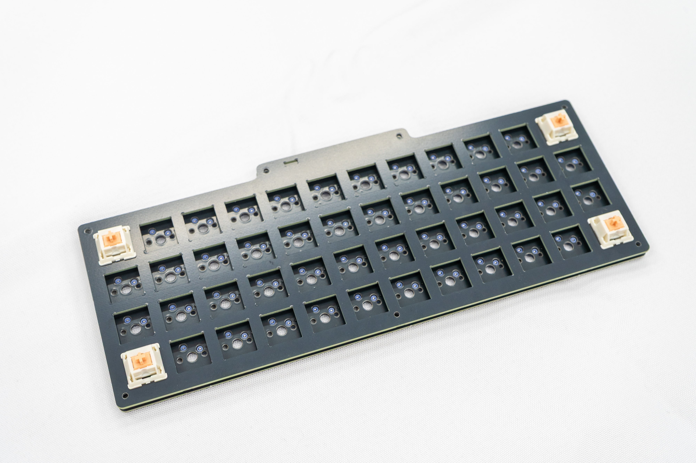
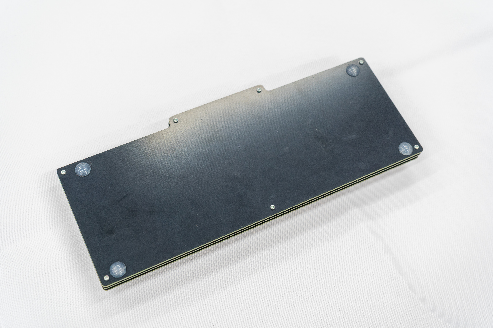
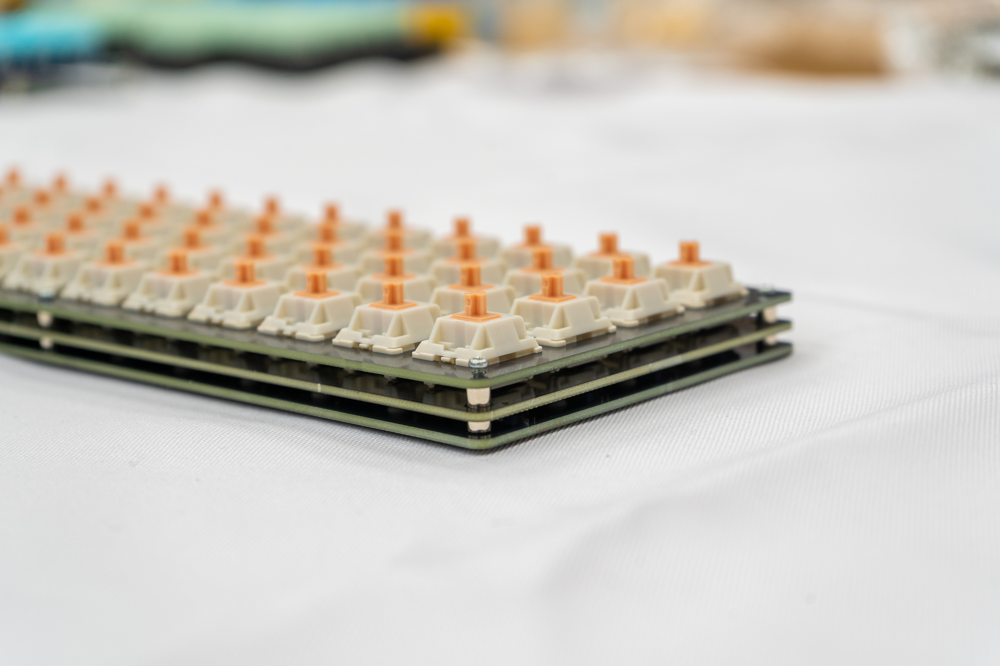
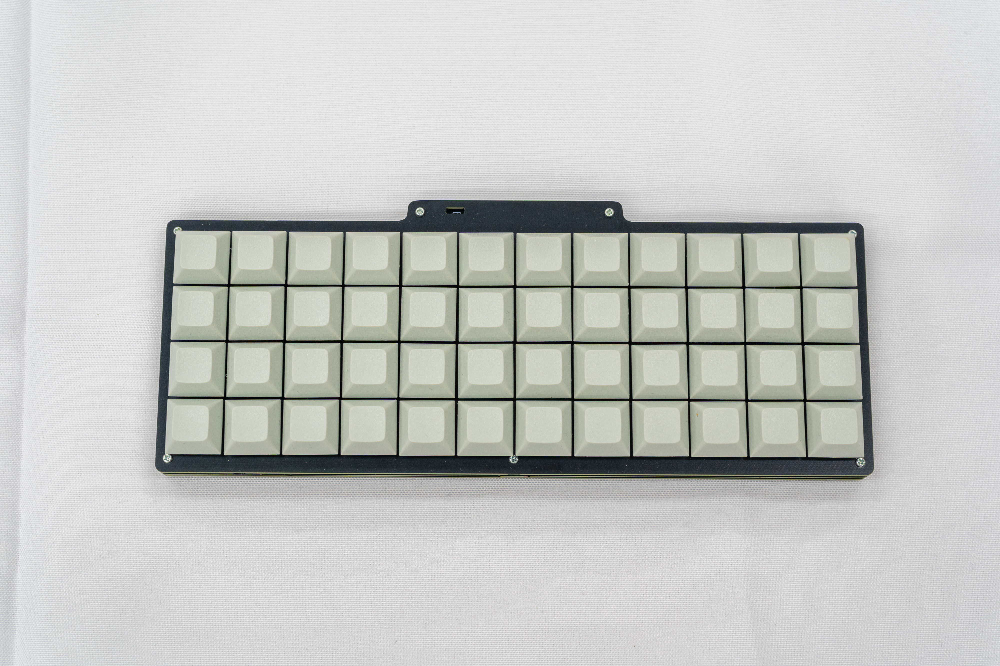
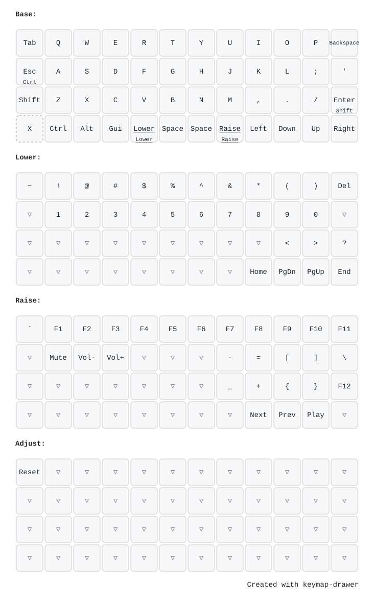
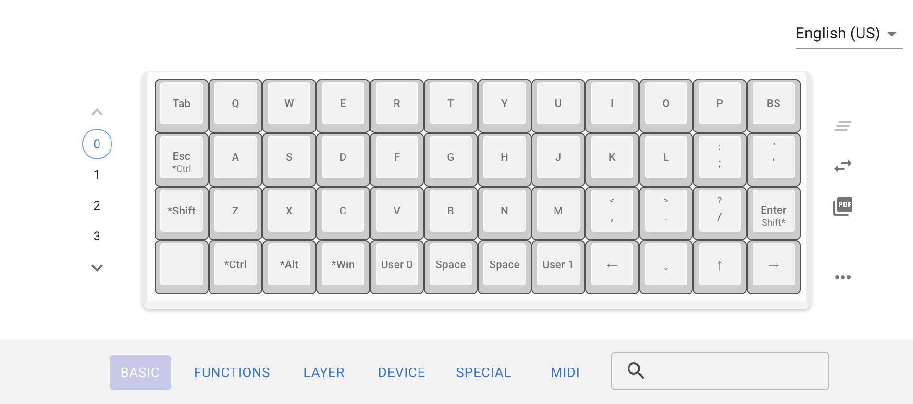

# nurikabe User Guide

nurikabeをご購入いただきありがとうございます。

> **お知らせ：ファームウェアを更新しました**
> 同梱のファームウェアに加え、有志による更新版（VIA/Remap版および新たにVial版）を用意しました。
> 書き換え手順と各バージョンの違いについては末尾の「[ファームウェアの更新](#ファームウェアの更新)」をご参照ください。

## 注意

本製品はDIYキットです。

**怪我・紛失:** キースイッチの端子やネジなど、細かく鋭利な部品を含みます。作業中の怪我や部品の紛失には十分ご注意ください。

**免責事項:** 本製品の製作、および使用により発生したいかなる損害に関しても、使用者の自己責任となります。あらかじめご了承ください。

## 内容物

製作前に、部品が揃っているかご確認ください。

スペーサーとネジは予備として多めに入っています。

| **内容物** | **数量** |
| --- | --- |
| M2 5mmネジ　 | 14本 |
| M2 8mmスペーサー | 7個 |
| トッププレート | 1枚 |
| ボトムプレート | 1枚 |
| メイン基板 | 1枚 |
| キースイッチ | 48個 |
| キーキャップ | 48個 |

※M2ネジを留めるには精密ドライバーが必要です。お持ちでない場合を別途お買い求めください。

また、追加で0603サイズのチップLEDをご購入いただくと、作動確認ランプとして使用できます。（なくても動作はします） [秋月電子などで販売されている](https://akizukidenshi.com/catalog/g/g118279/)汎用品が使用できます。IF 30mA, VF 2.5-2.9V 程度のLEDを推奨します。

## 組み立て方法

### 1.キースイッチを取り付ける

トッププレートの裏表を確認します。まずは四隅の4箇所だけ、キースイッチを「カチッ」と音がするまではめ込みます。 
スイッチには向きがあります．
下の写真を参考に，上から見たとき四角い穴が下に来るように取り付けてください．

その後、メイン基板の隅の穴とスイッチの足の位置を合わせ、慎重に取り付けます。これにより、プレートと基板のズレが抑えられ、作業がしやすくなります。

**注意：** キースイッチの端子が曲がっていないか必ず確認してください。曲がっている場合は、指やピンセットで真っ直ぐに直してから挿入してください。

残りの44個のキースイッチも同様に、端子が真っ直ぐであることを確認しながら、トッププレートの上から慎重に基板へと取り付けます。

全てのキースイッチの取り付けが終わったら、横から見てトッププレートが基板と水平であるか確認します。

もし傾いている場合、適宜キースイッチを押し込むなどして微調整します。

### 2.ファームウェアの動作確認

全てのキースイッチを取り付けた後、USBケーブルを使用してパソコンとnurikabeを接続します。

PC上にフォルダ（ドライブ）が開かない場合：接続した状態で、USB端子の隣にある**RESETボタンを2回**押してください。「RPI-RP2」というドライブとして認識されます。

起動したら、[https://github.com/uNikks/Pentronic-Lab/releases/tag/nurikabe](https://github.com/uNikks/Pentronic-Lab/releases/tag/nurikabe)にある[Remap_nurikabe.uf2](https://github.com/uNikks/Pentronic-Lab/releases/download/nurikabe/Remap_nurikabe.uf2)をダウンロードします。

ダウンロードした nurikabe_defult.uf2  ファイルを、先ほど開いた「RPI-RP2」ドライブ（エクスプローラー）へドラッグ＆ドロップしてください。
自動的に再起動し、キーボードとして認識されれば成功です！

> 別バージョンのファームウェア（Vial版）を使用したい場合は、後述の「[ファームウェアの更新](#ファームウェアの更新)」を参照してください。

### 3.ボトムプレートの取り付け

ボトムプレートの7箇所の穴に、下からネジを通します。飛び出したネジ山に対し、スペーサーを指でくるくると回して固定します。

スペーサーの付いたボトムプレートの上に、先ほどスイッチを取り付けた「基板＋トッププレート」のセットを重ねます。ネジ穴の位置が合うように調整してください。

トッププレートの上からネジで止めれば完成は目前です！！

### 4.キーキャップをはめる

仕上げにキーキャップを取り付けます。 キースイッチの十字（+）と、キーキャップ裏側の十字（+）が合うように向きを確認し、垂直に押し込みます。48個すべて取り付けたら完成です。

以上で組み立ては終了です。お疲れ様でした。

## キーマップ

デフォルトのキーマップは以下の構成になっております。

nurikabeではレイヤーという機能により、同じキーに複数の機能が割り当てられています。

例えばLowerキーを長押ししながらAのキーを押すと、1が入力できます。

キーボードのキーマップは変更することが可能です。

その場合必要なファイルがもう一つあり、nurikabe_via.jsonを[ここ](https://github.com/uNikks/Pentronic-Lab/releases/download/nurikabe/nurikabe_via.json)からダウンロードします。

[remap](https://remap-keys.app/)にアクセスし、[サリチル酸さんの記事](https://salicylic-acid3.hatenablog.com/entry/remap-manual)**のRemapにキーマップがマージされていない場合**を参考に、キーマップを変更してください。

キーボードをカスタマイズを押す     

 キーボードを認識させる

ダウンロードしたファイルをここでuploadする。

あなただけのキーマップを作り上げましょう！

---

## ファームウェアの更新

従来のファームウェアに加えて、以下のVialバージョンを新たに用意しました。同じ初期キーマップ（上記「キーマップ」と同一の Base / Lower / Raise / Adjust 構成）が書き込まれていますので、好みの編集環境に合わせてお選びください。

| バージョン | 特徴 | 編集ツール |
| --- | --- | --- |
| **Remap版（VIA）** | 軽量。Webブラウザだけで使えます。 | [Remap](https://remap-keys.app/) / VIAアプリ |
| **Vial版** | マクロ・タップダンス・コンボ・QMK設定までGUIで編集可能。キーボード定義はファームに内蔵されているので、別途JSONをアップロードする必要はありません。 | [Vial Web](https://vial.rocks/) / Vialアプリ |

### 1. 書き換え用のリセット手順

ファームウェアを書き換えるには、まずキーボードを **「RPI-RP2」ドライブ（書き込みモード）** として認識させる必要があります。以下のいずれかの手順でリセットしてください。

#### 手順A（推奨：USBケーブルを抜き差しできる場合）

1. USBケーブルを一旦抜きます。
2. **基板裏面のUSB端子の左側にある2つのボタンのうち、基板の端にある方**のボタンを押したまま、USBケーブルを差し込みます。
3. ボタンを離します。
4. PC上に「RPI-RP2」というドライブが表示されれば成功です。

#### 手順B（USBは接続したままにしたい場合）

USBコネクタ横の2つのボタンを上から **①, ②** とします。PCに接続した状態で、以下の順に操作してください。

1. **② を押下**（押したまま維持）
2. **① を押下**（押したまま維持）
3. **② を解放**
4. **① を解放**

この手順後、10秒ほど待ってもドライブとして認識されない場合は、①と②を入れ替えた以下の手順もお試しください。

1. **① を押下**（押したまま維持）
2. **② を押下**（押したまま維持）
3. **① を解放**
4. **② を解放**

「RPI-RP2」ドライブとして認識されれば、書き換えの準備は完了です。

### 2. ファームウェアの書き込み

1. 上記いずれかの手順で「RPI-RP2」ドライブとして認識させます。
2. 使用したいバージョンの `.uf2` ファイルをダウンロードします。
   - **Remap版**：`Remap_nurikabe.uf2`
   - **Vial版**：`Vial_nurikabe.uf2`
3. ダウンロードした `.uf2` ファイルを「RPI-RP2」ドライブにドラッグ＆ドロップしてください。
4. 自動的に再起動し、新しいファームウェアでキーボードとして認識されれば成功です。

> Remap版とVial版は排他的に動作しますが、いつでもこの手順を繰り返して書き換えできます。試してみて好みの方を選んでください。

### 3. Vial版の使い方

Vial版を書き込んだら、[**Vial Web (https://vial.rocks/)**](https://vial.rocks/) にアクセスするだけで使えます。インストール不要です。

> **対応ブラウザ：** Vial Web は WebHID API を使うため、**Chrome / Edge / Chromium系ブラウザ**でのみ動作します。Firefox / Safari では使えませんのでご注意ください。
> インストール版が好みの方は [get.vial.today/download](https://get.vial.today/download/) からデスクトップアプリも入手できます。

#### 基本的な使い方

1. nurikabe を USB でPCに接続します。
2. ブラウザで [https://vial.rocks/](https://vial.rocks/) を開きます。
3. 画面上部の **"Start Vial Web"** または **"Authorize device"** をクリックし、ダイアログから nurikabe を選んで接続します。
4. 接続されると、画面に4x12のレイアウトと現在のキーマップが表示されます。
5. 編集したいキーをクリックして選択 → 下のパレットから割り当てたいキーコードを選ぶ、で変更できます。変更は即座にキーボードに書き込まれます（保存ボタン不要）。
6. 左サイドバーから **Layers**（レイヤー編集）、**Macros**（マクロ）、**Tap Dance**（タップダンス）、**Combos**（複数キー同時押し）、**Key Overrides**、**QMK Settings** などの機能が利用できます。

#### Vial のロック解除（Unlock）について

マクロ編集など一部の機能を使う際に、Vialから「キーボードをアンロックしてください」と促されることがあります。これは悪意あるWebサイトが勝手にキーボードを書き換えるのを防ぐためのセキュリティ機構です。

本ファームウェアでは、**Tab キー（左上）と 右矢印キー（右下）を同時に押し続ける**ことでアンロックできるよう設定しています。Vialのダイアログに従って2キーを押し続け、解除されたら離してください。

#### キーマップを初期状態に戻したい場合

Vial の左サイドバーから `Security` → `Reset EEPROM` を選ぶと、ファームに焼き込まれた初期キーマップ（上記「キーマップ」と同じ構成）に戻ります。

---

何かお困りの際は、組み立て・ファームウェアいずれについても自己責任の範囲で各種ドキュメントをご参照ください。良いnurikabeライフを！
