# ぷちくる 取扱説明書
ぷちくるをご購入いただきありがとうございます。

## 1. 注意事項
> [!WARNING]
> 本製品はDIYキットです。はんだごてを含む怪我の危険性のある機器を使用する必要があります。十分注意して作業を行うようにしてください。
> 
> また、本製品は完成後、コンピュータ等に接続することで、USBキーボードとして使用することができますが、本製品の使用によって発生するいかなる損失についても、本製品の使用者は自己責任とします。

## 2. 内容物と別途必要なもの

| 品名 | 数量 |
|------|------|
| メイン基板 | 1枚 |
| ボトムプレート | 1枚 |
| オリジナルノブ | 1個 |
| ロータリーエンコーダー | 1個 |
| RP2040-zero (ピンヘッダ付き) | 1個 |
| M2 3mmネジ | 4本 |
| M2 10mm スペーサー | 2本 |

他に組み立て時に、はんだづけ用の器具、ドライバーが必要です。

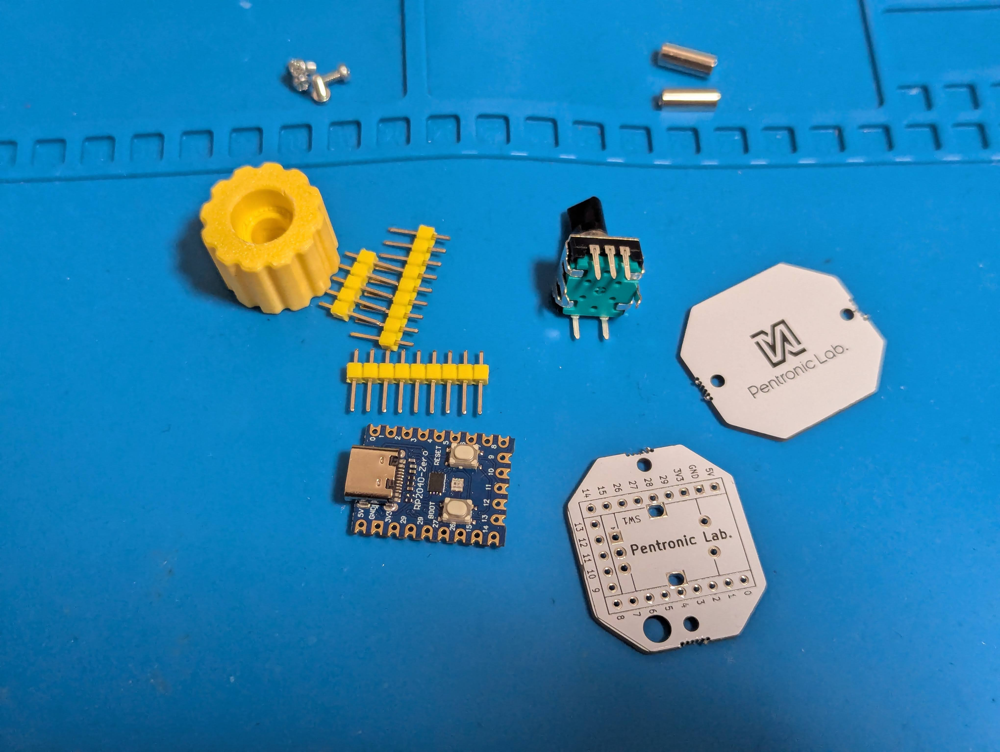
## 3. 組み立て方

### 1. ロータリーエンコーダーをはんだ付けする
まず、ロータリーエンコーダーを基板に差し込みます。このとき、**もころんやロゴが印刷されているほうが、上側になるようにしてください**

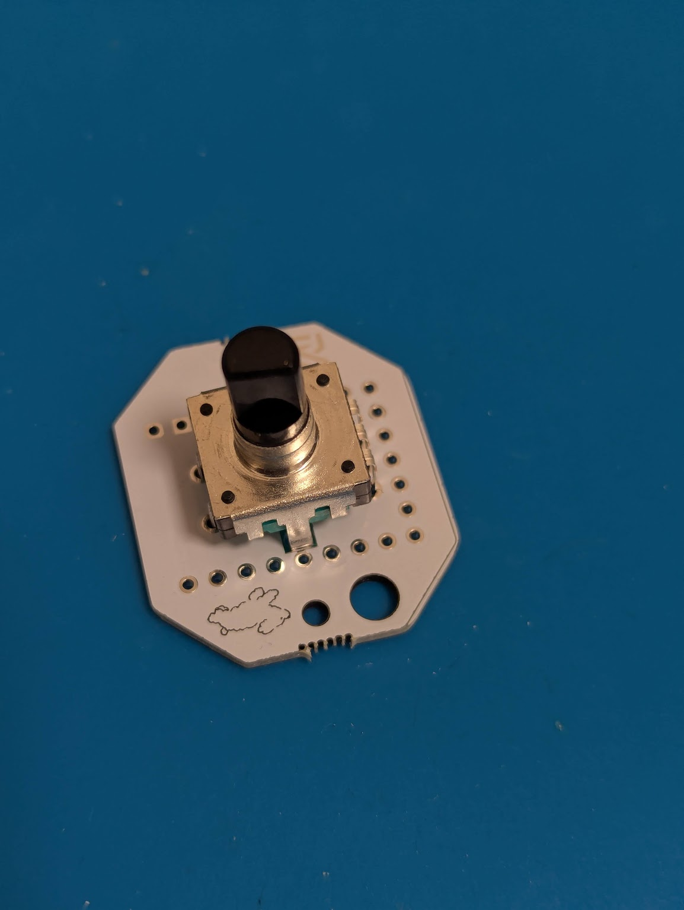

裏側から見るとこのようになります。

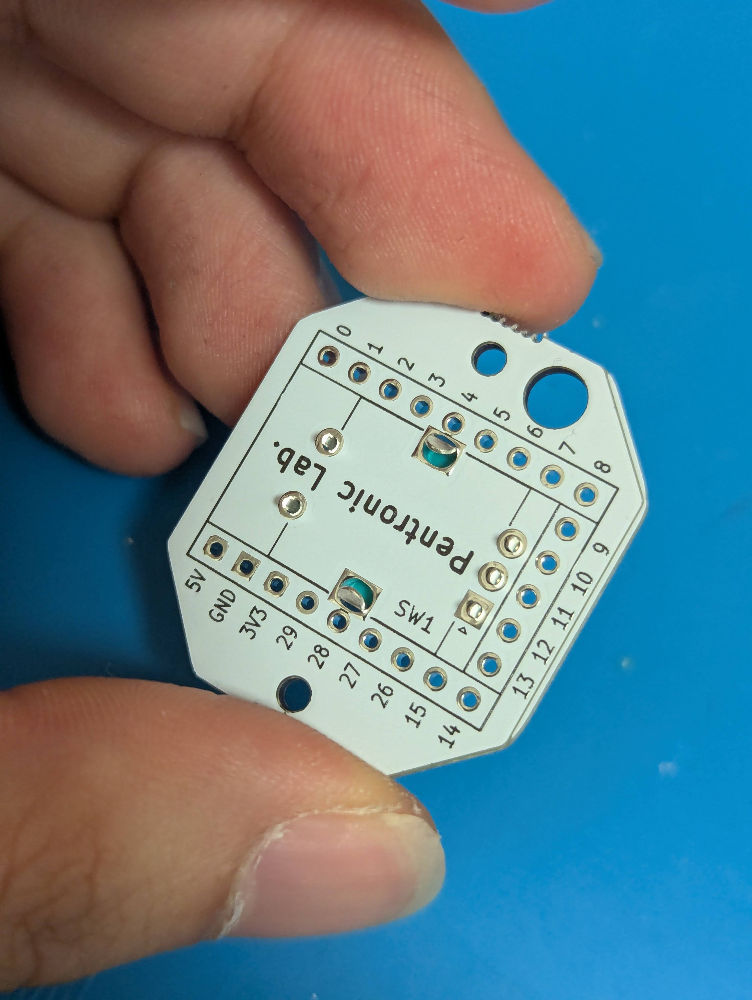

裏側をはんだ付けします。このとき、実際の回路に使われているのは、
3ピンが横に並んでいる部分とその反対側の2ピンの部分なので、その部分のみはんだ付けし、爪ははんだ付けしなくても大丈夫です。

はんだ付けのやり方については、[イチケンさんの動画](https://www.youtube.com/watch?v=dQ7AUjb1tkA)がわかりやすく、おすすめです。

はんだ付け後はこのようになります。

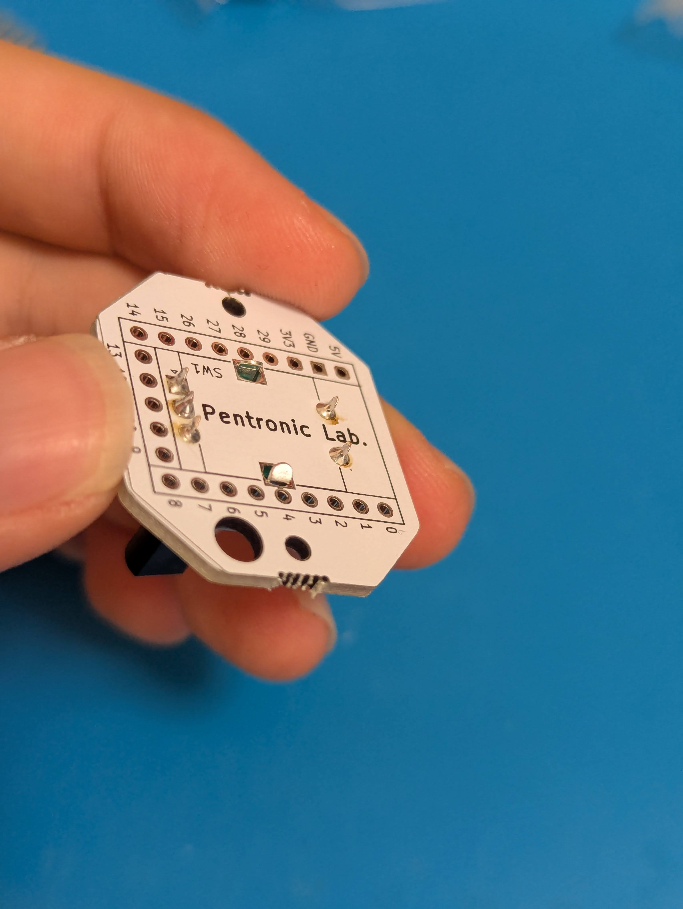

### 2. ピンヘッダを基板にはんだ付けする
ピンヘッダ(たくさん棒が刺さった黄色いパーツ)を、基板に刺します。
**このとき、向きは上側に棒が出っ張らないようにします。**
黄色の部分がロータリーエンコーダーの下側に来るように、また長い棒が下側に来るように、ピンヘッダを刺します。

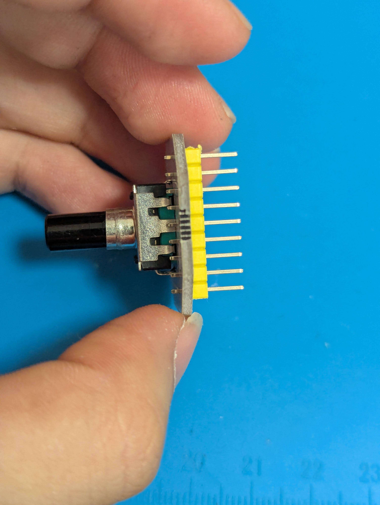

この段階で3つすべてを差し込んでしまって大丈夫です。ピンヘッダで自立するようにします。
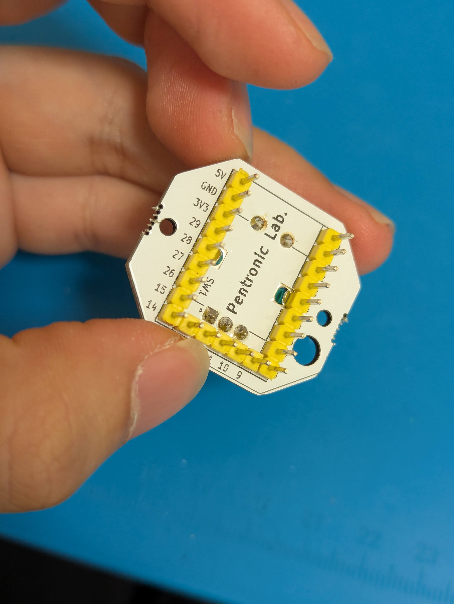

上側からはんだ付けします。このとき、すべてのピンをはんだ付けしてもいいですが、下の図のように、本当に必要な部分のみはんだ付けしても大丈夫です。

赤い部分は実際に回路で使用されている部分、青い部分はピンヘッダの固定用にはんだ付けしたほうが良い部分です。

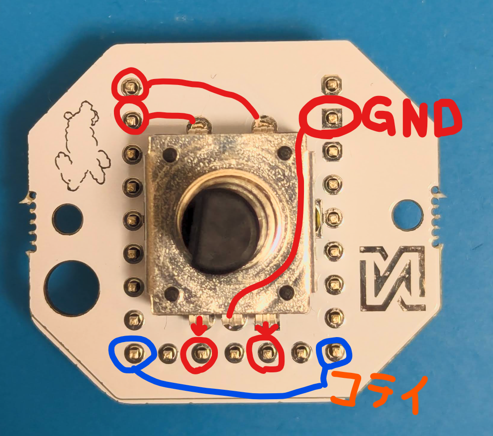

はんだ付けした後はこんな感じになります

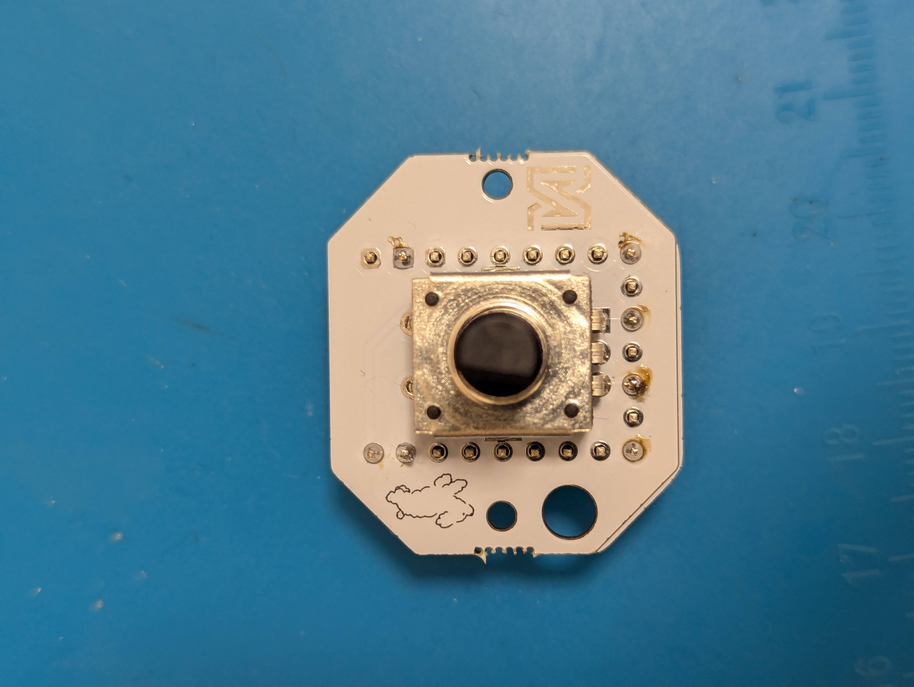

### 3. RP2040-zeroをピンヘッダにはんだ付けする
RP2040-zeroを裏側にピンヘッダに対して差し込み、はんだ付けします。
このとき、白いボタンが着いているほうが表側に見えるようにはんだ付けしてください。
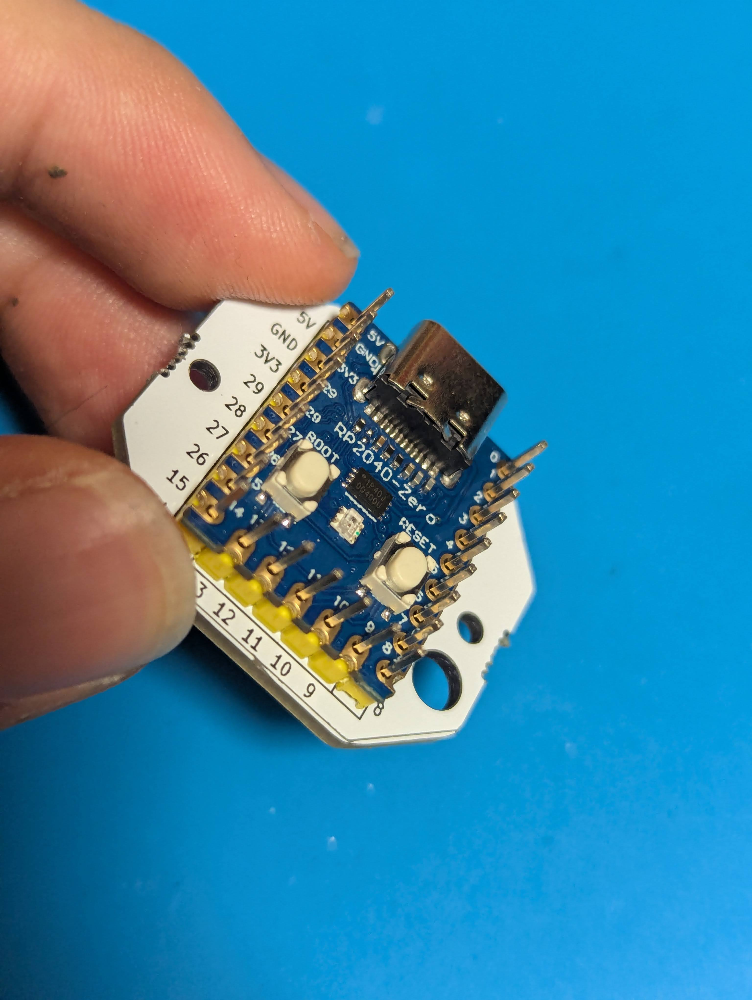

先ほどと同様に、必要な部分だけはんだ付けすると以下のようになります。
(こちら側は、番号がかいているので、0,1,10,12,14,GNDに半田付けすれば良いです)
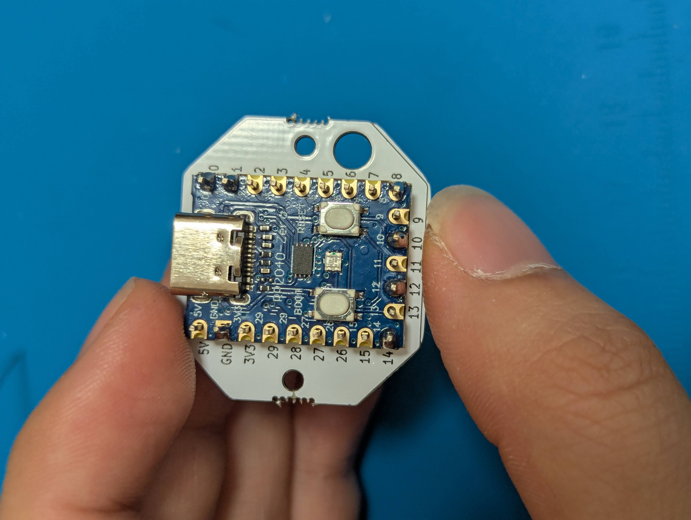

### 4. ファームウェアを書き込む
組み立て前にファームウェアを書き込んでしまいましょう。

まず、[ここ](https://github.com/uNikks/Pentronic-Lab/releases/tag/petitcuru)から、ぷちくるのファームウェア(`petitcuru_vial.uf2`)をダウンロードします。

パソコンとUSB-Cで接続します。

PC上にフォルダ（ドライブ）が開かない場合：接続した状態で、USB端子の右下にある**RESETボタンを2回**押してください。「RPI-RP2」というドライブとして認識されます。

先ほどダウンロードしたファイルを、「RPI-RP2」ドライブ（エクスプローラー）へドラッグ＆ドロップしてください。
自動的に再起動し、クルクル回すと、音量が変わるようになっていれば成功です！

### 5. ボトムプレートを取り付ける
最後に、完成に向けてボトムプレートを取り付けます。

まず、ボトムプレートにネジを差し込み、上からスペーサーを手で回してはめます。

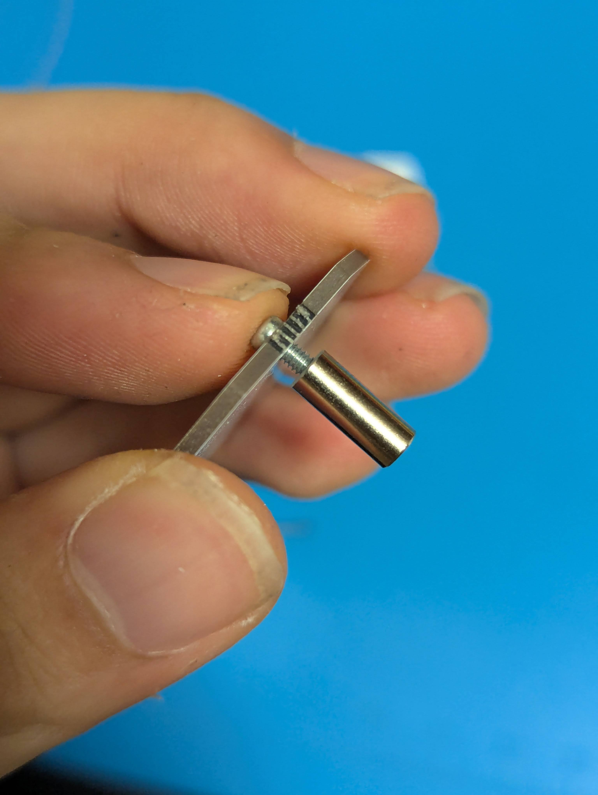
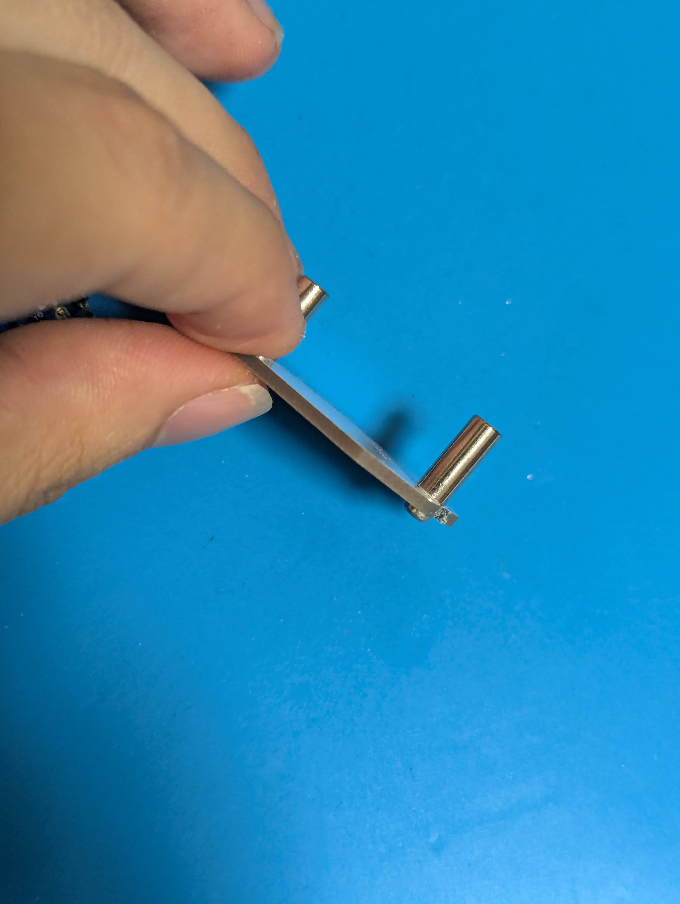

上から先ほどまで組み立てていた本体を載せて、ネジで締めてください。
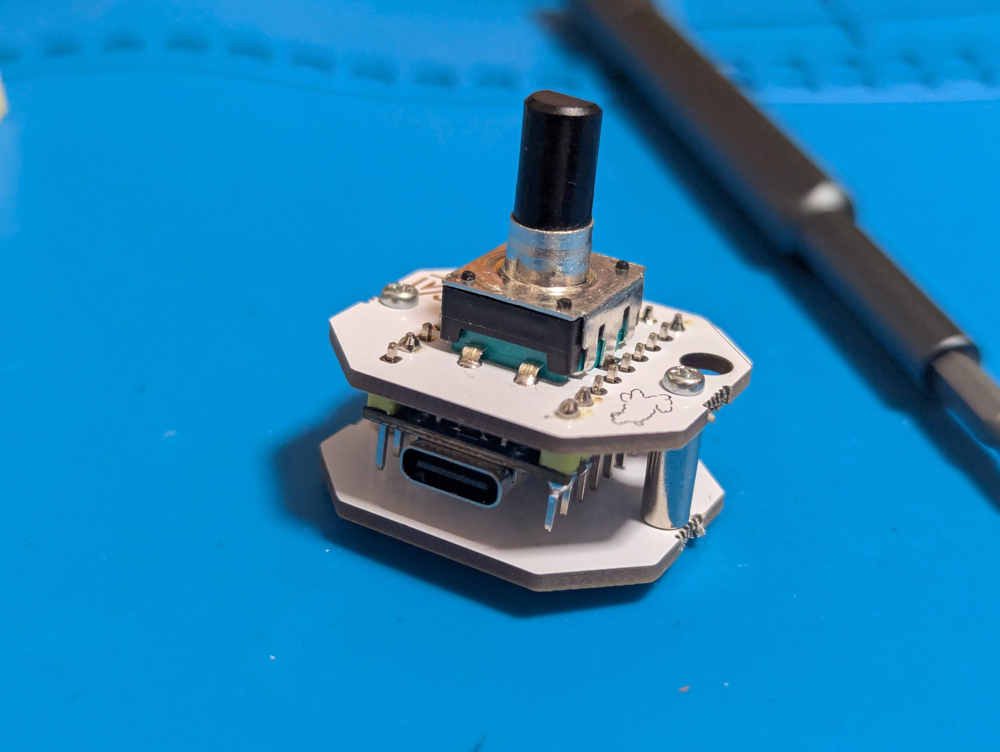

最後に、上からノブを取り付ければ完成です！
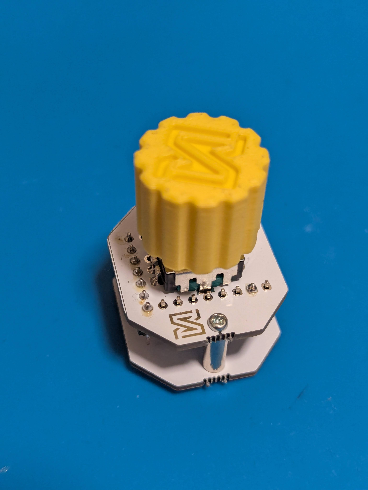

## 4. 自分オリジナルにカスタマイズする！
ぷちくるには初めから、ブラウザ上で自由にカスタマイズするソフトウェアを書き込んであります。vialというサイトで、カスタマイズすることができます。

[vial](https://vial.rocks/)にアクセスし、Start Vial、petitcuruを選択して、キーマップを変更してください。

vialの詳しい使用法については、[サリチル酸さんの記事](https://salicylic-acid3.hatenablog.com/entry/vial-manual)をご覧ください。

