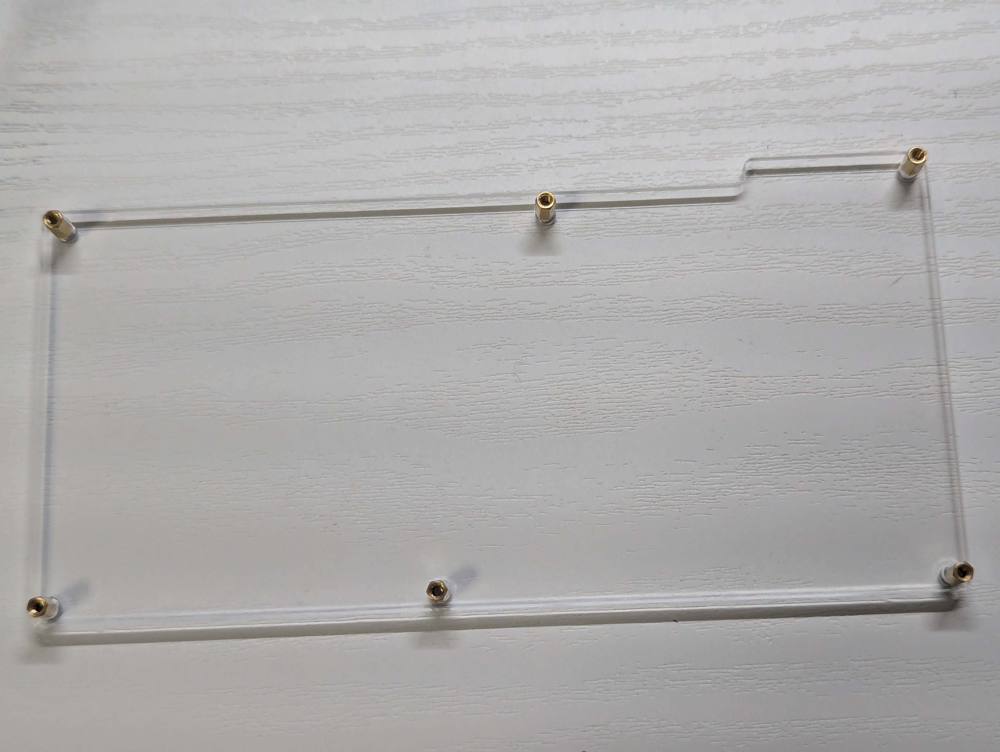
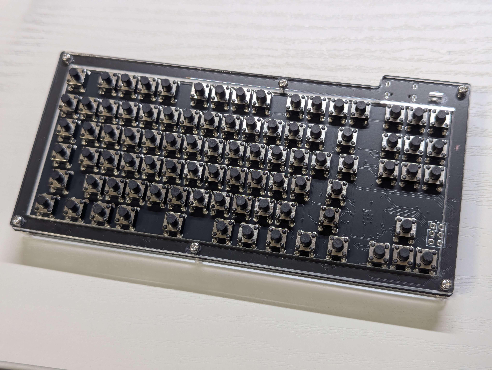

# Taclick-TKL 取り扱い説明書
Taclick-TKLを購入していただきありがとうございます。

## 目次
- [1. 注意事項](#1-注意事項)
- [2. 内容物と別途必要なもの](#2-内容物と別途必要なもの)
- [3. 組み立て方（部品実装済みを購入された方向け）](#3-組み立て方部品実装済みを購入された方向け)
- [4. 組み立て方（スイッチ未実装を購入された方向け）](#4-組み立て方スイッチ未実装を購入された方向け)
- [5. キーマップを変更する](#5-キーマップを変更する)
- [6. 回路図](#6-回路図)
## 1. 注意事項
本製品はDIYキットです。特に、一部バージョンの製品を組み立てる際にははんだごてを含む怪我の危険性のある機器を使用する必要があります。十分注意して作業を行うようにしてください。

また、本製品は完成後、コンピュータ等に接続することで、USBキーボードとして使用することができますが、本製品の使用によって発生するいかなる損失についても、本製品の使用者は自己責任とします。

## 2. 内容物と別途必要なもの

ネジやスペーサーは予備用に多めに入っていることが多いです。

| 内容物 | 個数 |
|------|------|
| M2 5mmネジ | 12本 |
| M2 5mmスペーサー | 6個 |
| アクリルトップフレーム | 1個 |
| アクリルボトムプレート | 1個 |
| PCB（基板） | 1枚 |

もし不足があった場合は、お問い合わせより報告をお願いいたします。

M2ネジを留めるための精密ドライバーが工具として必要です。
また、ニッパーがあると基板の切り離しに便利です。

### タクトスイッチ未実装キットを購入された方

別途タクトスイッチが89個必要です。
[秋月電子などで販売されているものをご使用ください。](https://akizukidenshi.com/catalog/g/g103647/)
五月祭では、使用可能なスイッチも販売しています。

また、電源確認用LEDとして0603サイズのチップLEDを用意してください。（なくても動作はします）
[秋月電子などで販売されているもの](https://akizukidenshi.com/catalog/g/g118279/)で大丈夫です。
実装済みキットでは、3.3Vの電源から1kΩの抵抗を介して、IF 30mA, VF 2.5-2.9VのLEDに接続しています。

## 3. 組み立て方（部品実装済みを購入された方向け）

### 1. 基板を確認する
組み立て済みの基板を購入された方はまず、パーツの欠損などがないことをご確認ください。

### 2. 基板をフレームから取り出す
基板をフレームから取り外してください。ニッパーがあると便利ですが、ハサミなどでも代用可能です。手でもできますが、痛いと思います。

特に上側のこの部分は基板が残ってしまいやすいです。根元から手で折るのがコツですが、無理せずニッパーを使用するのが最も効率が良いです。

※このように残ることが非常によくあります。

取れた後も、とげのような部分が残ります。紙やすりなどで手で触っても痛くないようにするのがおすすめです。

### (オプション) 基板の端を黒く塗る
黒基板の場合、基板の端を写真のようにマジックで黒く塗りつぶしてあげると、見た目が非常によくなります。是非試してみてください。

### 3. 接続テスト
この段階でUSBを接続します。（USB Type-Cケーブルはご自身で用意ください。）

写真のように、青く光れば問題ありません。
この時点でキーが動作するか確認してみましょう。

まず、USB Type-Cで接続すると、Windowsの場合以下のようにエクスプローラーが開きます。

開かない場合、接続した状態で、resetボタンを2回押せば起動するはずです。（もしくはresetボタンを押しながら接続する。）

ここに、[https://github.com/uNikks/Pentronic-Lab/releases/tag/taclick-tkl](https://github.com/uNikks/Pentronic-Lab/releases/tag/taclick-tkl)にある、`taclick_tkl_default.uf2`をダウンロードし、このエクスプローラーまたはRPI-RP2に入れてください。

うまく書き込みが出来れば、キーボードとして使用できるはずです！

### 4. アクリルプレートを用意する
アクリルのプレートについている保護ビニールをはがしてください

### 5. 組み立てをする
まず、ボトムプレートに対して、スペーサーを装着します。下からネジを通し、上から手でスペーサーを回します。

上から見たときにこのようになればOKです。

この上に基板とアクリルトップフレームをネジ穴が合うように重ねます。

最後に、ねじ止めをすれば完成です！

お好みでキーキャップをつけてください。

## 4. 組み立て方（スイッチ未実装を購入された方向け）
基本的に実装済みと組み立て方と同じですが、スイッチのはんだ付けと、電源確認LEDのはんだ付け（なくても動作します）が必要です。

タクトスイッチを基板の穴にはめてはんだ付けを裏側から行ってください。
タクトスイッチの向きを間違えないように気をつけてください。

LEDはUSBの右側のコの字型にそって実装します。LEDについている縦線と、コの縦線側を合わせてはんだ付けしてください。

## 5. キーマップを変更する
キーボードはキーマップを変更することができます。

### 1 remapの場合（日本語対応！）
remapの場合、必要なファイルがもう一つあり、`taclick-remap.json`を[ここ](https://github.com/uNikks/Pentronic-Lab/releases/download/taclick-tkl/taclick-remap.json)からダウンロードします。

[remap](https://remap-keys.app/)にアクセスし、[サリチル酸さんの記事](https://salicylic-acid3.hatenablog.com/entry/remap-manual)**のRemapにキーマップがマージされていない場合**を参考に、キーマップを変更してください。

キーボードをカスタマイズを押す

キーボードを認識させる

ダウンロードした`json`ファイルをここでuploadする。

### 2 vialの場合（より細かなカスタマイズ・リアルタイム変更！）

再度キーボードをリセットし（リセット方法は同じです）、`taclick_tkl_vial.uf2`を[ここ](https://github.com/uNikks/Pentronic-Lab/releases/download/taclick-tkl/taclick_tkl_vial.uf2)からダウンロードし、コピーペーストしてください。

[vial](https://vial.rocks/)にアクセスし、キーマップを変更してください。

vialの詳しい使用法については、[サリチル酸さんの記事](https://salicylic-acid3.hatenablog.com/entry/vial-manual)をご覧ください。

## 6. 回路図

回路図からわかる通り、GPIOの9, 10, 11, 12番はご自由に使用いただけるピンとして、矢印キー右側にはんだ付け可能な箇所を用意しております。LEDの接続などにご自由にお使いください。

