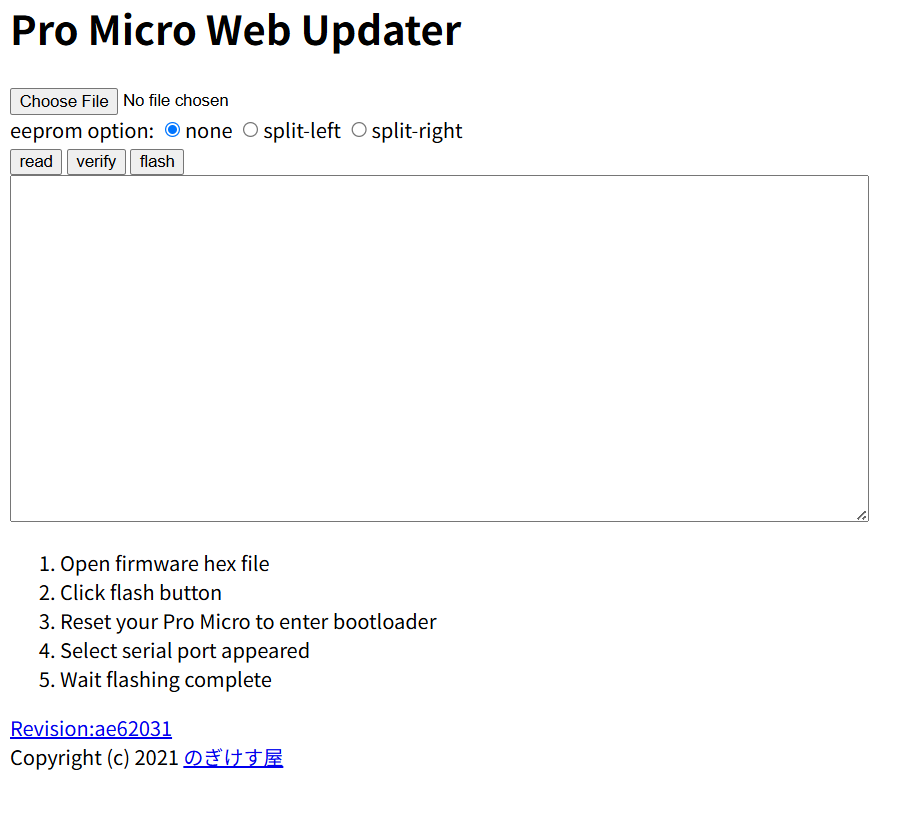
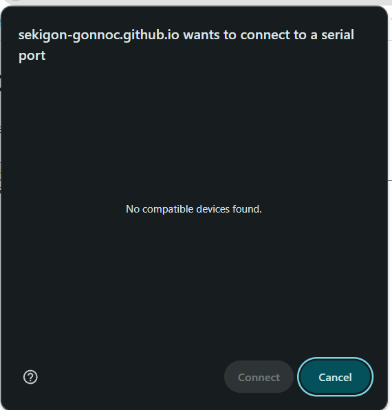
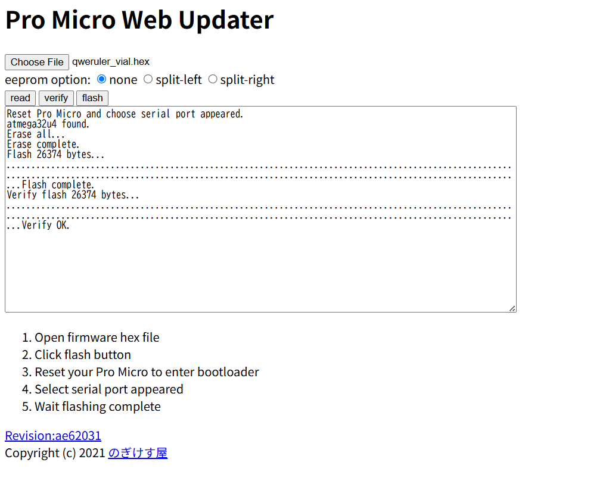
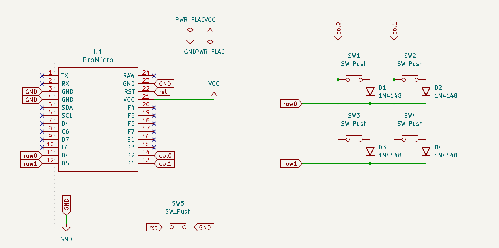

# QWERuler 取扱説明書
QWERuler (基板定規) を購入していただきありがとうございます。

## 1. 注意事項
本製品は精密な計量を目的としたものではありません。精密な計測のためには必ずJIS企画などに適合した定規を使用ください。

以下は、実装キットを購入された方への説明書となります。

本製品はDIYキットです。特に、一部バージョンの製品を組み立てる際にははんだごてを含む怪我の危険性のある機器を使用する必要があります。十分注意して作業を行うようにしてください。

また、本製品は完成後、コンピュータ等に接続することで、USBキーボードとして使用することができますが、本製品の使用によって発生するいかなる損失についても、本製品の使用者は自己責任とします。

## 2. 内容物と別途必要なもの

※ 五月祭2025で購入された方
| 品名 | 数量 |
|------|------|
| 基板定規 | 2枚 |
| キースイッチ | 4個 |
| キーキャップ | 4個 |
| M2 5mm ネジ | 8本 |
| M2 5mm スペーサー | 4個 |
| ダイオード 1N4148 | 4本 |
| タクトスイッチ | 1個 |
| ProMicro | 1個 |

他に組み立て時に、部品の切断用のニッパー、はんだづけ用の器具が必要です。

必要であれば、お好みの

### 組み立て前の注意
今回の五月祭のために用意したProMicroはUSB-C - USB-Cの接続に非対応とのことです。USB-A to USB-Cのケーブルをご利用いただくか、[遊者工房のProMicro](https://shop.yushakobo.jp/products/3905)などをご利用ください。

### お詫び
五月祭にて同封されておりました、M2ネジ及びスペーサーの組み合わせでは、最後の組み立て時にネジのサイズが合わず、組み立てられないことが判明しております。

誠に申し訳ございません。

**長さ3mm のM2ネジ**を8本用意していただく必要があります。[遊舎工房](https://shop.yushakobo.jp/products/a0800n2)や[Amazon](https://amzn.to/3YY45t2)、[モノタロウ](https://www.monotaro.com/g/00010425/?t.attr_f2=M2&t.q=3mm%20%E3%83%8D%E3%82%B8)などで入手可能です。

五月祭にて購入された方につきましては、弊団体の[お問い合わせフォーム](https://pentronic-lab.com/contact/)より、ご連絡いただきましたら、無償でネジを送付いたします。

改めてご迷惑をおかけし誠に申し訳ございません。

## 3. 組み立て方

### 1. マイコン以外の部品を基板定規にセットする

基板のメモリがないほうを上面として、部品をセットします。
最初にセットする部品は
- キースイッチ（赤色の十字ボタンのもの）
- ダイオード (個袋に4本入ったオレンジ色の部品)
- タクトスイッチ（個袋に1つだけ入っているボタン）

です。スイッチは上から押しこむことで、固定されます。

ダイオードは、線のあるほうと、ダイオードの黒い線が一致するように差し込みます。

タクトスイッチは強引に入れようとすると、縦横反対でも入ってしまいます。自然に入る向きで入れて固定してください。

### 2. マイコン以外の部品のはんだ付け

基板を裏返し、メモリのある方から、はんだ付けを行います。
はんだ付けの際には火傷をしないように十分注意してください。

はんだ付けは、後ろから飛び出た金属の端子と、基板のパッドと呼ばれる部分を接続するために行います。
スイッチの2箇所を4つ分、ダイオードの2箇所を4本文、タクトスイッチの4箇所を確実にはんだ付けしてください。

はんだ付けのやり方については、[イチケンさんの動画](https://www.youtube.com/watch?v=dQ7AUjb1tkA)がわかりやすく、おすすめです。

はんだ付け後、ダイオードのいらない部分はニッパーでカットしてしまいましょう（本来、先にニッパーでカットするのが正しいですが、難易度が上がってしまうため、後回しにしても問題ありません。）

### 3. マイコンのはんだ付け

1. マイコンのはんだ付けは、付属のピンヘッダ（黒のプラスチックの上下に金属がある部品）と基板定規をはんだ付けするところからはじめます。

1. ピンヘッダの長いほうを基板定規に差し込み、裏側からはんだ付けします。　

1. 反対側からUSB-Cなどの部品が載っているほうを上にして、ProMicroを載せて、はんだ付けをします。この際、USBは基板定規の外側に向きます。

少々はんだ付けが大変な部分ですが、頑張ってください。

完成系はこんな感じになります。

### 4. 組み立てをする
もう1本の基板定規に、スペーサーとネジを固定します。
向きはネジがメモリ側、スペーサーが部品接地面側です。

最後に、上から部品をはんだ付けしてある定規を載せて、ねじ止めをして完成です！

### 5. ファームウェアの書き込み

見た目上は完成していますが、これだけだとProMicroと呼ばれるマイコンにどのキーを押したらどのキーをパソコンに送信するか、という情報が入っていないため、何もできません。

そこで、ここにファームウェアと呼ばれるソフトウェアを書き込みます。

まず、[ここ](https://github.com/uNikks/Pentronic-Lab/releases/tag/qweruler)から、QWERulerのファームウェア(`qweruler_default.hex`)をダウンロードします。

ProMicroを（付属のものの場合）USB-A to USB-Cケーブルで接続します。

タクトスイッチを3回連続で押すと、ProMicroがリセットされます。（windowsであれば接続解除、接続の音が再度流れるはずです。）

次に、[Pro Micro Web Updater](https://sekigon-gonnoc.github.io/promicro-web-updater/index.html)にアクセスします。

choose fileから、先ほどダウンロードしてファームウェアを選択してください。

flashボタンを押すと、このような画面が出てきます。

もし、以下の画像のようになっていた場合、リセットやUSB接続をやり直してください。

connectボタンを押すと、書き込みが始まります。（うまくいかない場合はリセットからやり直してください。）

ProMicroのLEDのうち、電源確認用以外のLEDが点灯していれば問題ありません。

このようになっていれば書き込み成功です！

USBをさし直してキーを押してみると、qwerが打てるはずです。

## 4. キーマップの変更
qwerでは役に立たないので、割り当てるキーを変更しましょう。

### 1 remapの場合（日本語対応！）

remapの場合、必要なファイルがもう一つあり、`qwer-remap.json`を[ここ](https://github.com/uNikks/Pentronic-Lab/releases/download/qweruler/qweruler-remap.json)からダウンロードします。

[remap](https://remap-keys.app/)にアクセスし、[サリチル酸さんの記事](https://salicylic-acid3.hatenablog.com/entry/remap-manual)**のRemapにキーマップがマージされていない場合**を参考に、キーマップを変更してください。

キーボードをカスタマイズを押す

キーボードを認識させる（qwerulerと出るはずです。）

ダウンロードした`json`ファイルをここでuploadすると、編集画面が表示される。

### 2 vialの場合（より細かなカスタマイズ・リアルタイム変更！）

再度タクトスイッチから、キーボードをリセットし、`qweruler_vial.hex`を[ここ](https://github.com/uNikks/Pentronic-Lab/releases/download/qweruler/qweruler_vial.hex)からダウンロードし、書き込みを同じ方法で行ってください。

[vial](https://vial.rocks/)にアクセスし、キーマップを変更してください。

vialの詳しい使用法については、[サリチル酸さんの記事](https://salicylic-acid3.hatenablog.com/entry/vial-manual)をご覧ください。

## 5. 回路図

トラブルシューティングのため、回路図を掲載します。

