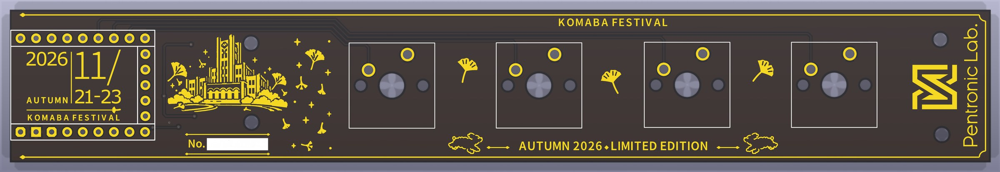
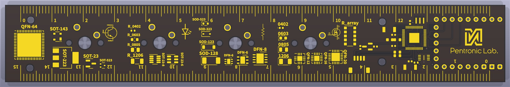
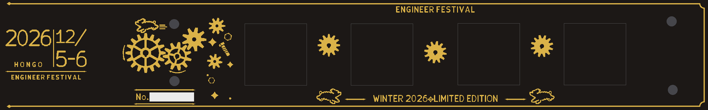
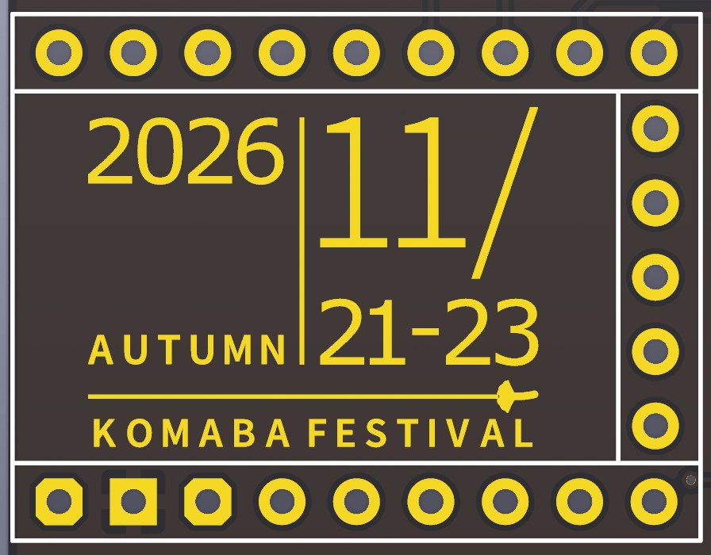
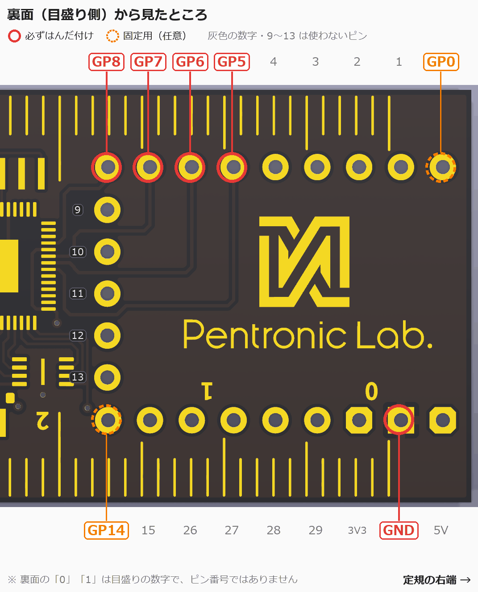
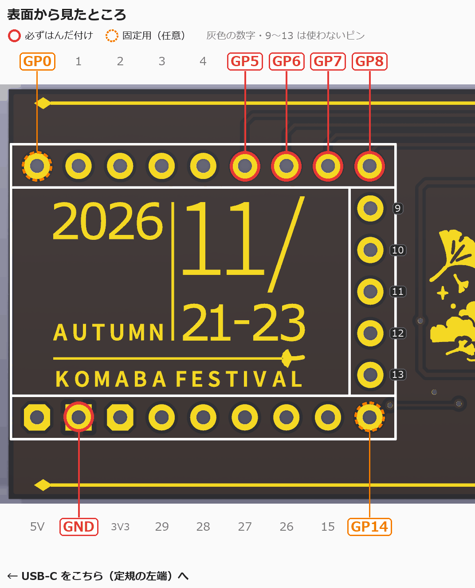
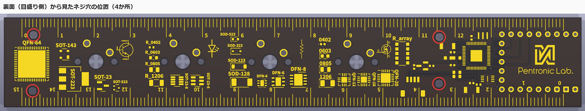
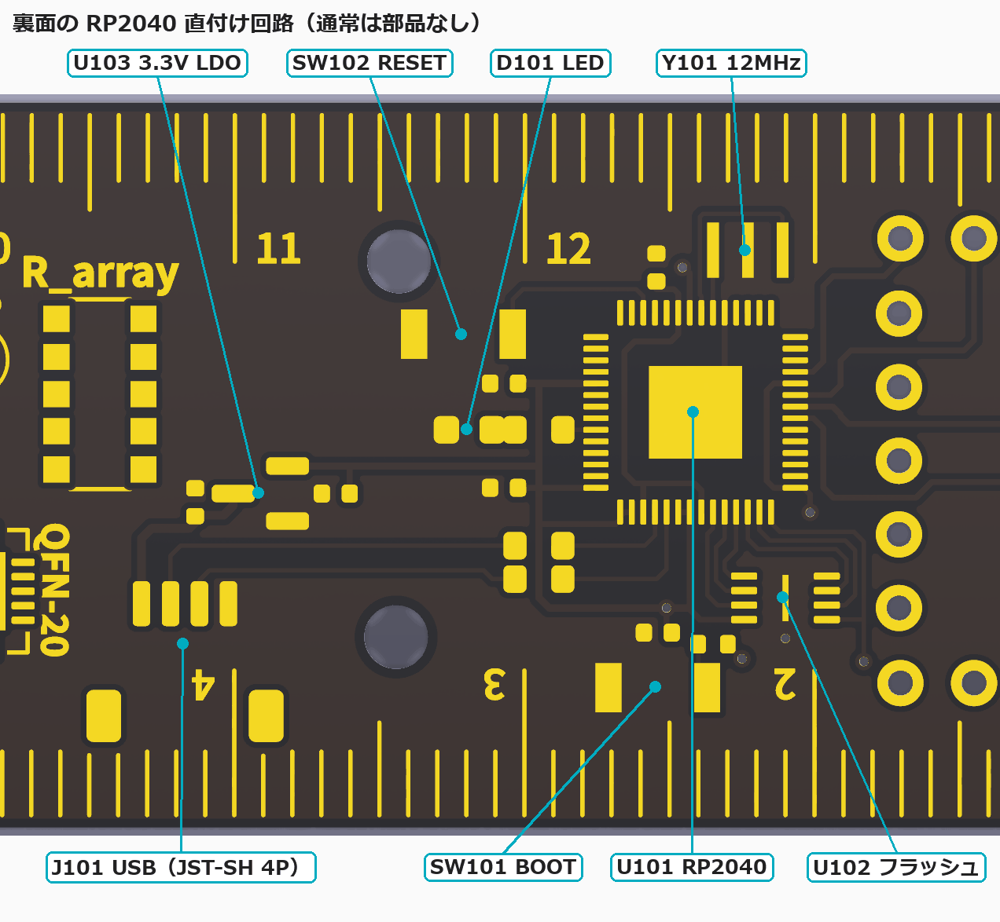

# QWERuler premium 取扱説明書
QWERuler premium (基板定規・黒×金の限定版) を購入していただきありがとうございます。

## 注意事項
本製品は精密な計量を目的としたものではありません。精密な計測のためには必ずJIS規格などに適合した定規を使用ください。

以下は、実装キットを購入された方への説明書となります。

> [!WARNING]
> 本説明は**2026年度駒場祭・2026年度エンジニアフェスティバルで販売する**黒×金の限定版「QWERuler premium」実装キットの説明です。
>
> 通常版のQWERulerを購入された方は、以下をご覧ください。
> - 2025年度五月祭・駒場祭で購入された方は[こちら](../qweruler/README.md)
> - 2025年度エンジニアフェスティバル in 東大以降で購入された方は[こちら](../qweruler_rev2/README.md)

本製品はDIYキットです。特に、一部バージョンの製品を組み立てる際にははんだごてを含む怪我の危険性のある機器を使用する必要があります。十分注意して作業を行うようにしてください。

また、本製品は完成後、コンピュータ等に接続することで、USBキーボードとして使用することができますが、本製品の使用によって発生するいかなる損失についても、本製品の使用者は自己責任とします。

## QWERuler premium について
QWERuler premium は、160×25mm の基板定規と4キーのマクロパッドを組み合わせた QWERuler の、黒×金の限定版です。

黒いレジスト（基板の表面を覆う膜）に窓を開け、その下の銅箔に金めっき（ENIG）をかけることで、蒔絵のような金の模様を描いています。

エディションは2種類あります。回路・組み立て方・ファームウェアはどちらも同じです。

| エディション | 表面の文字 | こだわりの絵 | シリアル番号 |
|------|------|------|------|
| 2026駒場祭版 | KOMABA FESTIVAL | 駒場キャンパスの1号館と銀杏 | `KF26-0001` 〜 |
| 2026エンジニアフェスティバル版 | ENGINEER FESTIVAL | かみ合う歯車と、その上を走るもころん | `EF26-0001` 〜 |

エンジニアフェスティバル版は、2026年度エンジニアフェスティバル（2026年12月5日・6日、東京大学本郷キャンパス）で販売します。

2026駒場祭版（表面・裏面、レンダリング画像）

2026エンジニアフェスティバル版（表面、試作イメージ）

> [!NOTE]
> エンジニアフェスティバル版の基板は現在デザインを調整中です。下の画像は金の部分だけを平面で描いた**試作イメージ**で、実物とは異なる場合があります。

<!-- TODO: 写真 実物（駒場祭版・エンジニアフェスティバル版）の表面・裏面の写真を追加する。エンジニアフェスティバル版は基板が確定したら試作イメージをレンダリングか写真に差し替える -->

### 表面
- 金のフレーム
- 上の帯のキャプション（KOMABA FESTIVAL / ENGINEER FESTIVAL）と、下の帯の「AUTUMN 2026 ◆ LIMITED EDITION」（駒場祭版）
- 左側のこだわりの絵（エディションごとに異なります）
- シリアル番号の銘板「No.」：白い枠の中に、1枚ずつ異なる番号（例：`KF26-0001`）が印字されています
- 隠し刻印：RP2040-Zero を取り付ける白い枠の内側に、金の刻印があります（モジュールを取り付けると見えなくなります）

### 裏面（定規面）
- 目盛り・数字・パッケージ名がすべて金になっています
- RP2040 直付け回路（上級者向けのオプション。[後述](#上級者向け裏面の-rp2040-直付け回路)）

> [!NOTE]
> 金色の部分は、すべて GND（グラウンド）の銅箔の上に金めっきをしたものです。はんだ付けのときは、はんだが金の部分に触れないように注意してください（触れると、そのキーが押されっぱなしになるなどの原因になります）。

### 通常版（rev2）との違い
- ダイオードがなくなりました（各キーをマイコンのピンに直接つないでいます）
- 裏面にあった RP2040-Zero のピン番号の表示（0, 7, 8, 14, 15, GND など）はなくなりました。はんだ付けする場所は[図](#1-ピンヘッダを取り付ける)で説明します
- ファームウェアが違います。rev2 用のファームウェア（`qweruler_rev2_vial.uf2`）は使えません

## 内容物と別途必要なもの

<!-- TODO: premium のキット内容を確定させる。現在は rev2 のキットからダイオードを除いたものを仮に記載している（基板定規の枚数と2枚目が premium 基板か通常版か、キースイッチの種類（5ピン/3ピン）、キーキャップの種類・色） -->

> [!NOTE]
> 下の表は rev2 のキットをもとにした暫定の内容です。「（要確認）」の項目は変わる可能性があります。

| 品名 | 数量 |
|------|------|
| 基板定規 | 2枚（要確認） |
| キースイッチ（MX互換・PCBマウント） | 4個（要確認） |
| キーキャップ | 4個（要確認） |
| M2 3mm ネジ | 8本 |
| M2 5mm スペーサー | 4個 |
| RP2040-Zero（ピンヘッダ付き） | 1個 |

ダイオードは不要になったため、入っていません。

<!-- TODO: 写真 内容物一覧（rev2 の parts_all.jpg に相当） -->

他に組み立て時に、部品の切断用のニッパー、はんだづけ用の器具が必要です。

必要であれば、お好みのキースイッチやキーキャップをご用意ください。キースイッチは MX 互換・PCBマウントのもの（5ピン・3ピンどちらでも可）が使えます。

## 組み立て方
部品はすべて**表面**（金のフレームや絵がある面）から差し込み、**裏面**（目盛りがある面）からはんだ付けします。

### 1. ピンヘッダを取り付ける

> [!TIP]
> RP2040-Zero を取り付けると、白い枠の中の隠し刻印は見えなくなります。取り付ける前に、ぜひ一度ご覧ください（刻印の内容はエディションごとに異なります）。
>
> 

ピンヘッダは金色の棒が沢山刺さっているパーツで、RP2040-Zero に付属しています。今回は長い2本（9ピン）のみを使います。

これを表面の白い枠の、上下の長い辺に沿って9個ずつ並んだ穴に、プラスチック部分と短い棒が表面側にくるようにして差し込みます。白い枠の右側に縦に並んだ5つの穴は使いません。

> [!WARNING]
> RP2040-Zero は**必ずピンヘッダで浮かせて**取り付けてください。モジュールを基板に直接重ねてはんだ付けしてはいけません。
>
> 白い枠の内側にある隠し刻印は、金めっきされた GND の銅箔がむき出しになっています。モジュールを基板に密着させると、モジュールの裏面のパッドやはんだが刻印に触れてショートするおそれがあります。ピンヘッダのプラスチック部分は外さず、基板とモジュールのあいだに挟んだままにしてください。

<!-- TODO: 写真 ピンヘッダを表面から差し込んだところ（rev2 の pinheader_1.jpg に相当） -->

反対側（裏面）からはんだ付けします。このとき、必要なのは5ピンだけで、固定用と合わせて6〜7つはんだ付けすれば十分です。

premium の裏面にはピン番号が書かれていないので、下の図で場所を確認してください。裏面から見ると、モジュールの穴は定規の右端にあります。

- **上の列の、左から4つ**：GP8・GP7・GP6・GP5（それぞれキーにつながっています）
- **下の列の、右から2つ目**（四角いパッド）：GND
- 固定用（任意）：上の列のいちばん右（GP0）と、下の列のいちばん左（GP14）

> [!NOTE]
> 裏面のモジュールの穴の近くにある「0」「1」などの数字は目盛りの数字で、ピン番号ではありません。

はんだ付けのやり方については、[イチケンさんの動画](https://www.youtube.com/watch?v=dQ7AUjb1tkA)がわかりやすく、おすすめです。

まず、1ピンだけはんだ付けして、位置合わせをします。

ピンヘッダが傾いてしまった時は、はんだごてを先ほどはんだ付けした部分に当てながら、指で他のピンを抑えて正しい位置にします。

<!-- TODO: 写真 ずれてしまったときの直し方（rev2 の pinheader_3.jpg / pinheader_4.jpg に相当） -->

ピンのすぐ近くまで金の目盛りがあります。はんだを盛りすぎて、目盛りとつながらないように注意してください。

<!-- TODO: 写真 裏面からはんだ付けし終わったところ（rev2 の pinheader_5.jpg に相当） -->

### 2. マイコンを取り付ける
RP2040-Zero を、表面のピンヘッダに差し込みます。USB-C コネクタなどの部品が載っている面を上にして、**USB-C コネクタが定規の端（外側）を向く**ようにします。

<!-- TODO: 写真 RP2040-Zero を差し込んだところ（rev2 の rp2040zero_1.jpg に相当） -->

必要な部分をモジュールの上からはんだ付けします。モジュールに印字されている 5, 6, 7, 8, GND の5か所をはんだ付けすれば十分です（1. で固定用にはんだ付けした 0, 14 も、ここではんだ付けしておくと安定します）。

はんだ付けが終わったら、モジュールが基板から浮いていること（基板とモジュールのあいだにピンヘッダのプラスチックが挟まっていること）を確認してください。

<!-- TODO: 写真 RP2040-Zero をはんだ付けし終わったところ（rev2 の rp2040zero_2.jpg に相当） -->

### 3. スイッチをはんだ付けする
スイッチの金色の2つの金属を、表面（金のフレームがある面）から差し込みます。

<!-- TODO: 写真 スイッチを差し込んだところ（rev2 の switch_1.jpg に相当） -->

裏側からはんだ付けします。このとき、付属しているスイッチが3ピン(金属のピンと真ん中の白いピンしかない)の場合、スイッチの位置が完全に固定されていないため、1ピンはんだ付けして、位置調整をしながらはんだ付けするようにしてください。

<!-- TODO: 写真 片方ずつはんだ付けしているところ（rev2 の switch_2.jpg / switch_3.jpg に相当） -->

位置が良さそうであれば両方のピンをはんだ付けして終了です。

裏面は定規の面なので、はんだの盛り上がりは小さめにしましょう。ここでも、はんだが金の目盛りやラベルに触れないように注意してください。

### 4. 組み立てをする
もう1本の基板定規に、スペーサーとネジを固定します。
向きはネジが目盛り側、スペーサーが部品接地面側です。

ネジを下から差し込みます。

<!-- TODO: 写真 ネジを差し込むところ（rev2 の screw_1.jpg に相当） -->

差し込む場所は、裏面（目盛り側）の **QFN-64 の上下**と、**上の目盛りの「11」と「12」のあいだの上下**（R_array の右隣）の4か所です。

> [!NOTE]
> rev2 の説明書で「QFN-16 の上下」としていた穴と同じ位置です。premium ではこの場所の QFN-16 の見本がなくなり、代わりに RP2040 直付け回路が入っています（裏面の中ほどにある別の QFN-16 の近くではないので注意してください）。
>
> 2枚目の基板定規が通常版（rev2）の基板の場合は、[rev2 の説明書](../qweruler_rev2/README.md#5-組み立てをする)のとおり、QFN-16 の上下と QFN-64 の上下です。

<!-- TODO: 2枚目の基板定規（底板）が premium 基板か通常版かを確定させ、上の注記を整理する -->

<!-- TODO: 写真 ネジ・スペーサーを取り付けたところ（rev2 の screw_2.jpg〜screw_4.jpg に相当） -->

スペーサーを反対側から手で回して取り付けます。

上から本体を取り付けて、ドライバーでネジを回します。

<!-- TODO: 写真 本体を取り付けてネジを締めるところ（rev2 の screw_5.jpg に相当） -->

最後に、キーキャップを取り付けて完成です！

<!-- TODO: 写真 完成写真（rev2 の complete.jpg に相当） -->

### 5. ファームウェアの書き込み

<!-- TODO: リンク先のリリース（qweruler_premium）は、ファームウェアの PR がマージされてリリースが公開されるまで存在しない。公開後にリンクと uf2 のファイル名を確認する -->

まず、[ここ](https://github.com/uNikks/Pentronic-Lab/releases/tag/qweruler_premium)から、QWERuler premium のファームウェア(`qweruler_premium_vial.uf2`)をダウンロードします。駒場祭版・エンジニアフェスティバル版のどちらも同じファームウェアです。

> [!WARNING]
> rev2 用のファームウェア（`qweruler_rev2_vial.uf2`）は、キーのつなぎ方が違うため、premium では正しく動きません。必ず premium 用のファームウェアを使ってください。

パソコンとUSB-Cで接続します。

PC上にフォルダ（ドライブ）が開かない場合：接続した状態で、RP2040-Zero の RESET ボタンを2回押してください。「RPI-RP2」というドライブとして認識されます。RESET ボタンは、モジュールの2つのボタンのうち、上側（GP0〜GP8 の列に近いほう）にあります。

それでも「RPI-RP2」が出てこない場合は、BOOT ボタンを押したまま RESET ボタンを押して離してください。

先ほどダウンロードしたファイルを、「RPI-RP2」ドライブ（エクスプローラー）へドラッグ＆ドロップしてください。 自動的に再起動し、キースイッチを押したときに、QWERと打たれたら成功です！

## キーマップの変更
qwerでは役に立たないので、割り当てるキーを変更しましょう。

QWERuler premium のファームウェアははじめからvialに対応しています。

[vial](https://vial.rocks/)にアクセスし（Chrome や Edge などのブラウザを使ってください）、キーマップを変更してください。

vialの詳しい使用法については、[サリチル酸さんの記事](https://salicylic-acid3.hatenablog.com/entry/vial-manual)をご覧ください。

- vial で「Unlock（ロック解除）」を求められたときは、左端のキーと右端のキーを同時に長押ししてください。
- 左端のキーを押したまま USB を接続しても、ファームウェアの書き込みモード（「RPI-RP2」ドライブ）になります。このとき、vial で変更したキーマップは初期状態（QWER）に戻ります。

## 回路（トラブルシューティング用）
各キーは RP2040-Zero のピンに直接つながっています（ダイオードはありません）。キーを押すと、そのピンが GND につながります。

| キー（表面から見て左から） | RP2040-Zero のピン | もう一方のピン |
|------|------|------|
| SW1 | GP8 | GND |
| SW2 | GP7 | GND |
| SW3 | GP6 | GND |
| SW4 | GP5 | GND |

- どのキーも反応しない：GND のピンのはんだ付けと、ファームウェアの書き込みを確認してください
- 特定のキーだけ反応しない：そのキーのスイッチの2本のピンと、対応する GP ピン（裏面と、モジュールの上の両方）のはんだ付けを確認してください
- 押していないのに文字が入り続ける：はんだが金の部分（GND）とつながっていないか確認してください

## 上級者向け：裏面の RP2040 直付け回路
裏面の、モジュール用の穴のすぐ横（R_array とのあいだ）には、RP2040-Zero の代わりに RP2040 チップを直接はんだ付けして使うための回路が、金のパッドとして用意されています。部品を載せれば、モジュールなしで同じファームウェアが動きます。

> [!WARNING]
> - 通常は何も載せません。この回路の部品はキットには含まれていません。
> - RP2040-Zero と**同時に載せないでください**（キーのピン GP5〜GP8 などを共有しています）。
> - 0402 サイズの部品や QFN パッケージがあるため、ホットエアやホットプレートでの実装を前提としています。
> - この回路は、まだ実機での動作確認をしていません。

<!-- TODO: 直付け回路を実装・動作確認したら、上の「動作確認をしていません」を更新し、写真を追加する -->

| 記号 | 部品 | 数量 | 備考 |
|------|------|------|------|
| U101 | RP2040（QFN-56） | 1 | |
| U102 | W25Q16JVUXIQ（2MB フラッシュ、USON-8） | 1 | |
| Y101 | 12MHz セラミック発振子（3端子） | 1 | LCSC C341520 |
| U103 | XC6206P332MR（3.3V レギュレータ、SOT-23） | 1 | LCSC C347376 |
| J101 | JST SM04B-SRSS-TB（SH 1.0mm 4ピン） | 1 | USB 用 |
| SW101 / SW102 | Omron B3U-1000P | 2 | BOOT / RESET |
| D101 / R104 | LED 0603 / 1kΩ 0603 | 各1 | GP25 の LED |
| R101 / R102 | 27Ω 0603 | 2 | USB D− / D+ |
| R103 | 1kΩ 0402 | 1 | BOOT |
| C101〜C106 | 1µF ×4、100nF ×2（0402） | 6 | 電源のコンデンサ |

- USB は、ピン配置が **1=VBUS / 2=D− / 3=D+ / 4=GND** の JST-SH 4ピン → USB のケーブル（キーボード用の Unified Daughterboard と同じ並び）でつなぎます。差し口は定規の下側を向いています。ケーブルによってはピンの並びが異なるので、必ず確認してから接続してください。
- 書き込みは、BOOT ボタンを押したまま RESET ボタンを押して離すと「RPI-RP2」ドライブが出てくるので、同じ `qweruler_premium_vial.uf2` をドラッグ＆ドロップします。フラッシュが空のとき（はじめて書き込むとき）は、USB をつなぐだけで「RPI-RP2」ドライブになります。
